# systemToolChatAgent 函数调用流程图

> 阅读目标：用 Mermaid 图把 `systemToolChatAgent` 的主入口、核心循环、模型调用、工具执行、删除确认和日志链路串起来。  
> 阅读方式：先看第 1 部分总览图，再按第 2 部分的分块图逐块阅读源码。

---

## 0. 快速定位

| 你要找什么 | 文件 | 核心函数 / 类 |
|---|---|---|
| CLI 主入口 | `systemToolChatAgent/cliApp.py` | `main()` |
| HTTP 主入口 | `systemToolChatAgent/httpServer.py` | `main()` |
| 共享核心 | `systemToolChatAgent/agentCore.py` | `agentCore` |
| 模型适配器 | `systemToolChatAgent/openaiAdapter.py` | `openaiCompatibleAdapter.complete()` |
| 工具注册 | `systemToolChatAgent/toolRegistry.py` | `createDefaultToolRegistry()` |
| 工具路由 | `systemToolChatAgent/toolRouter.py` | `toolRouter.executeTool()` |
| 删除命令检测 | `systemToolChatAgent/toolGuard.py` | `checkToolCall()` / `detectDeletionCommand()` |
| 文件工具 | `systemToolChatAgent/fileTools.py` | `executeRead()` / `executeWrite()` / `executeEdit()` |
| Bash 工具 | `systemToolChatAgent/bashTool.py` | `executeBash()` |
| 会话管理 | `systemToolChatAgent/conversationManager.py` | `conversationManager.addMessage()` / `addToolResult()` |
| JSONL 日志 | `systemToolChatAgent/jsonlLogger.py` | `jsonlLogger.logEvent()` / `makePreview()` |

---

# 第一部分：总览大图

这张图把 CLI、HTTP、`agentCore`、模型、工具、删除确认、日志全部串起来。  
先用它建立全局认知，再看第二部分的分块图。

```mermaid
flowchart TD
    start([用户启动程序])
    start --> chooseEntry{选择入口}
    chooseEntry --> cliMain["cliApp.main()"]
    chooseEntry --> httpMain["httpServer.main()"]

    subgraph cliStartup["CLI 启动链路"]
        cliMain --> cliParseArgs["argparse.ArgumentParser.parse_args()"]
        cliParseArgs --> cliBuildAgent["cliApp.buildAgent(debugEnabled, workDir)"]
        cliBuildAgent --> cliPrinter["debugPrinter.__init__(isDebug)"]
        cliBuildAgent --> cliLoadConfig["modelRegistry.loadModelConfigFromEnv()"]
        cliLoadConfig --> cliModelConfig["agentTypes.modelConfig"]
        cliBuildAgent --> cliAdapter["openaiAdapter.openaiCompatibleAdapter.__init__(config, printer)"]
        cliBuildAgent --> cliRegistry["toolRegistry.createDefaultToolRegistry()"]
        cliRegistry --> cliRegisterRead["toolRegistry.register(read)"]
        cliRegistry --> cliRegisterWrite["toolRegistry.register(write)"]
        cliRegistry --> cliRegisterEdit["toolRegistry.register(edit)"]
        cliRegistry --> cliRegisterBash["toolRegistry.register(bash)"]
        cliBuildAgent --> cliCoreInit["agentCore.agentCore.__init__(modelAdapter, registry, workDir, logDir, confirmDeletion)"]
        cliCoreInit --> cliLoop["CLI while True 输入循环"]
        cliLoop --> cliUserInput["input('你> ')"]
        cliUserInput --> cliRunMessage["agentCore.runUserMessage(userInput, sessionId)"]
    end

    subgraph httpStartup["HTTP 启动链路"]
        httpMain --> httpParseArgs["argparse.ArgumentParser.parse_args()"]
        httpParseArgs --> httpBuildAgent["httpServer.buildAgent(debugEnabled, workDir)"]
        httpBuildAgent --> httpPrinter["debugPrinter.__init__(isDebug)"]
        httpBuildAgent --> httpLoadConfig["modelRegistry.loadModelConfigFromEnv()"]
        httpLoadConfig --> httpModelConfig["agentTypes.modelConfig"]
        httpBuildAgent --> httpAdapter["openaiAdapter.openaiCompatibleAdapter.__init__(config, printer)"]
        httpBuildAgent --> httpRegistry["toolRegistry.createDefaultToolRegistry()"]
        httpBuildAgent --> httpCoreInit["agentCore.agentCore.__init__(modelAdapter, registry, workDir, logDir, confirmDeletion=None)"]
        httpCoreInit --> makeHandler["httpServer.makeHttpHandler(agent)"]
        makeHandler --> serverInit["ThreadingHTTPServer((host, port), handler)"]
        serverInit --> serveForever["ThreadingHTTPServer.serve_forever()"]
        serveForever --> doPost["agentHttpHandler.do_POST()"]
        doPost --> routeHttp{HTTP path}
        routeHttp -->|/chat| handleChat["agentHttpHandler.handleChat()"]
        routeHttp -->|/confirm| handleConfirm["agentHttpHandler.handleConfirm()"]
        handleChat --> readJsonChat["agentHttpHandler.readJson()"]
        readJsonChat --> httpRunMessage["agentCore.runUserMessage(message, sessionId)"]
        handleConfirm --> readJsonConfirm["agentHttpHandler.readJson()"]
        readJsonConfirm --> continueConfirm["agentCore.continueConfirmation(sessionId, confirmationId, approved)"]
    end

    subgraph coreLoop["共享核心链路：agentCore"]
        cliRunMessage --> runUserMessage["agentCore.runUserMessage(message, sessionId)"]
        httpRunMessage --> runUserMessage
        runUserMessage --> cleanMessage{"message.strip() 是否为空"}
        cleanMessage -->|是| emptyResult["agentRunResult(status='error')"]
        cleanMessage -->|否| createOrUseSession["agentCore.createSessionId() 或使用传入 sessionId"]
        createOrUseSession --> getConversation["agentCore.getConversation(sessionId)"]
        getConversation --> hasConversation{"conversations 中是否已有 session"}
        hasConversation -->|否| createConversation["conversationManager.__init__(sessionId, logPath, systemPrompt)"]
        createConversation --> createLogger["jsonlLogger.__init__(logPath)"]
        createConversation --> addSystemMessage["conversationManager.addMessage(systemMessage)"]
        addSystemMessage --> logSystem["jsonlLogger.logEvent(type='message', role='system')"]
        hasConversation -->|是| existingConversation["返回已有 conversationManager"]
        logSystem --> addUserMessage["conversationManager.addMessage(userMessage)"]
        existingConversation --> addUserMessage
        addUserMessage --> logUser["jsonlLogger.logEvent(type='message', role='user')"]
        logUser --> continueLoop["agentCore.continueModelLoop(sessionId)"]
    end

    subgraph modelCall["模型调用链路：OpenAI-compatible"]
        continueLoop --> loopStep["for stepIndex in range(maxModelSteps)"]
        loopStep --> listTools["toolRegistry.listModelTools()"]
        listTools --> listDefinitions["toolRegistry.listDefinitions()"]
        loopStep --> adapterComplete["openaiCompatibleAdapter.complete(messages, tools)"]
        adapterComplete --> getApiKey["os.getenv(config.apiKeyEnv)"]
        adapterComplete --> convertMessages["openaiCompatibleAdapter.convertMessage(message)"]
        adapterComplete --> buildRequest["urllib.request.Request(baseUrl + '/chat/completions')"]
        buildRequest --> urlopen["urllib.request.urlopen(request, timeout=60)"]
        urlopen --> parsePayload["openaiCompatibleAdapter.parseAssistantPayload(payload)"]
        parsePayload --> assistantMessage["agentTypes.chatMessage(role='assistant', toolCalls=...)"]
        assistantMessage --> addAssistantMessage["conversationManager.addMessage(assistantMessage)"]
        addAssistantMessage --> hasToolCalls{"assistantMessage.toolCalls 是否为空"}
    end

    subgraph finalAnswer["无工具调用：直接返回答案"]
        hasToolCalls -->|是，空| completedResult["agentRunResult(status='completed', message=assistantMessage.content)"]
        completedResult --> cliPrintResult["CLI: print('Agent> ...')"]
        completedResult --> httpRespondResult["HTTP: agentHttpHandler.respondJson(200, resultToDict(result))"]
    end

    subgraph toolExecution["工具调用链路：toolRouter"]
        hasToolCalls -->|否，有 toolCalls| iterateCalls["for call in assistantMessage.toolCalls"]
        iterateCalls --> guardCheck["toolGuard.checkToolCall(call)"]
        guardCheck --> isDeletion{"guard.requiresConfirmation 是否为 True"}
        isDeletion -->|否| createRouter["agentCore.createRouter()"]
        createRouter --> createContext["agentTypes.toolExecutionContext(workDir, debugPrinter)"]
        createContext --> routerInit["toolRouter.toolRouter.__init__(registry, context)"]
        routerInit --> executeTool["toolRouter.executeTool(call, approvedDeletion=False)"]
        executeTool --> registryGet["toolRegistry.get(call.toolName)"]
        registryGet --> knownTool{"是否找到 toolDefinition"}
        knownTool -->|否| unknownToolResult["toolResult(isError=True, content='未知工具')"]
        knownTool -->|是| routerGuardAgain["toolGuard.checkToolCall(call)"]
        routerGuardAgain --> routerNeedsConfirm{"需要确认且未 approvedDeletion"}
        routerNeedsConfirm -->|是| raiseConfirm["raise deletionConfirmationNeeded(reason)"]
        routerNeedsConfirm -->|否| dispatchTool{"call.toolName"}
        dispatchTool -->|read| executeRead["fileTools.executeRead(arguments, context)"]
        dispatchTool -->|write| executeWrite["fileTools.executeWrite(arguments, context)"]
        dispatchTool -->|edit| executeEdit["fileTools.executeEdit(arguments, context)"]
        dispatchTool -->|bash| executeBash["bashTool.executeBash(arguments, context)"]
        executeRead --> normalizeReadPath["fileTools.normalizePath(path, workDir)"]
        executeWrite --> normalizeWritePath["fileTools.normalizePath(path, workDir)"]
        executeEdit --> normalizeEditPath["fileTools.normalizePath(path, workDir)"]
        executeRead --> readFile["Path.read_text()"]
        executeWrite --> writeFile["Path.write_text()"]
        executeEdit --> editDiff["difflib.unified_diff()"]
        executeEdit --> editWrite["Path.write_text(updatedContent)"]
        executeBash --> debugBash["debugPrinter.debug('执行 bash')"]
        executeBash --> subprocessRun["subprocess.run(['bash', '-lc', command], ...)"]
        readFile --> previewRead["jsonlLogger.makePreview(content)"]
        writeFile --> previewWrite["jsonlLogger.makePreview(content)"]
        editDiff --> previewDiff["jsonlLogger.makePreview(diffText)"]
        subprocessRun --> previewStdout["jsonlLogger.makePreview(stdout)"]
        subprocessRun --> previewStderr["jsonlLogger.makePreview(stderr)"]
        previewRead --> toolResultRead["toolResult(toolName='read')"]
        previewWrite --> toolResultWrite["toolResult(toolName='write')"]
        previewDiff --> toolResultEdit["toolResult(toolName='edit')"]
        previewStdout --> toolResultBash["toolResult(toolName='bash')"]
        previewStderr --> toolResultBash
        unknownToolResult --> addToolResult["conversationManager.addToolResult(result)"]
        toolResultRead --> addToolResult
        toolResultWrite --> addToolResult
        toolResultEdit --> addToolResult
        toolResultBash --> addToolResult
        addToolResult --> logToolResult["jsonlLogger.logEvent(type='toolResult')"]
        logToolResult --> appendToolMessage["messages.append(chatMessage(role='tool'))"]
        appendToolMessage --> loopStep
    end

    subgraph deletionConfirm["删除命令确认链路"]
        isDeletion -->|是| hasConfirmHandler{"agentCore.confirmDeletion 是否存在"}
        hasConfirmHandler -->|CLI 存在| cliAskDelete["cliApp.askDeletionConfirmation(call, reason)"]
        cliAskDelete --> cliApproved{"用户输入 y/yes?"}
        cliApproved -->|是| cliExecuteApproved["toolRouter.executeTool(call, approvedDeletion=True)"]
        cliExecuteApproved --> addToolResult
        cliApproved -->|否| cliBlockedResult["toolGuard.makeBlockedToolResult(call, reason)"]
        cliBlockedResult --> addToolResult
        hasConfirmHandler -->|HTTP 不存在| createConfirmId["uuid4() 生成 confirmationId"]
        createConfirmId --> savePending["pendingConfirmations[confirmationId] = pendingConfirmation(...)"]
        savePending --> confirmationRequiredResult["agentRunResult(status='confirmationRequired', confirmationId, commandPreview)"]
        confirmationRequiredResult --> httpRespondConfirmRequired["HTTP: respondJson(200, resultToDict(result))"]
        continueConfirm --> popPending["pendingConfirmations.pop(confirmationId)"]
        popPending --> pendingExists{"pending 是否存在且 sessionId 匹配"}
        pendingExists -->|否| confirmError["agentRunResult(status='error', message='确认请求不存在或 sessionId 不匹配')"]
        pendingExists -->|是| approvedBranch{"approved 是否为 True"}
        approvedBranch -->|是| httpExecuteApproved["toolRouter.executeTool(pending.toolCall, approvedDeletion=True)"]
        httpExecuteApproved --> httpAddToolResult["conversationManager.addToolResult(result)"]
        approvedBranch -->|否| httpBlockedResult["toolGuard.makeBlockedToolResult(pending.toolCall, pending.reason)"]
        httpBlockedResult --> httpAddToolResult
        httpAddToolResult --> httpContinueLoop["agentCore.continueModelLoop(sessionId)"]
        httpContinueLoop --> loopStep
    end

    subgraph errors["错误链路"]
        adapterComplete --> modelException{"模型请求异常?"}
        modelException -->|是| logModelError["jsonlLogger.logEvent(type='modelError')"]
        logModelError --> modelErrorResult["agentRunResult(status='error', message='模型调用失败')"]
        loopStep --> maxStepsExceeded{"超过 maxModelSteps?"}
        maxStepsExceeded -->|是| maxStepResult["agentRunResult(status='error', message='模型循环超过最大步数')"]
    end
```

---

# 第二部分：分块流程图

## 2.1 CLI 启动和交互流程

这部分只看命令行入口。  
结论：`cliApp.py` 只负责参数解析、构造 `agentCore`、读取用户输入、打印结果。

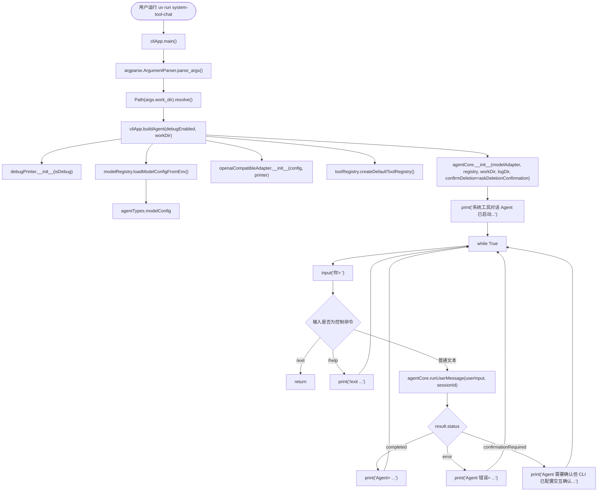

### CLI 读码顺序

```text
1. cliApp.main()
2. cliApp.buildAgent()
3. cliApp.askDeletionConfirmation()
4. agentCore.runUserMessage()
```

---

## 2.2 HTTP 启动和请求路由流程

这部分只看 HTTP 入口。  
结论：HTTP 不直接确认删除，而是通过 `/chat` 返回 `confirmationRequired`，再由 `/confirm` 继续。

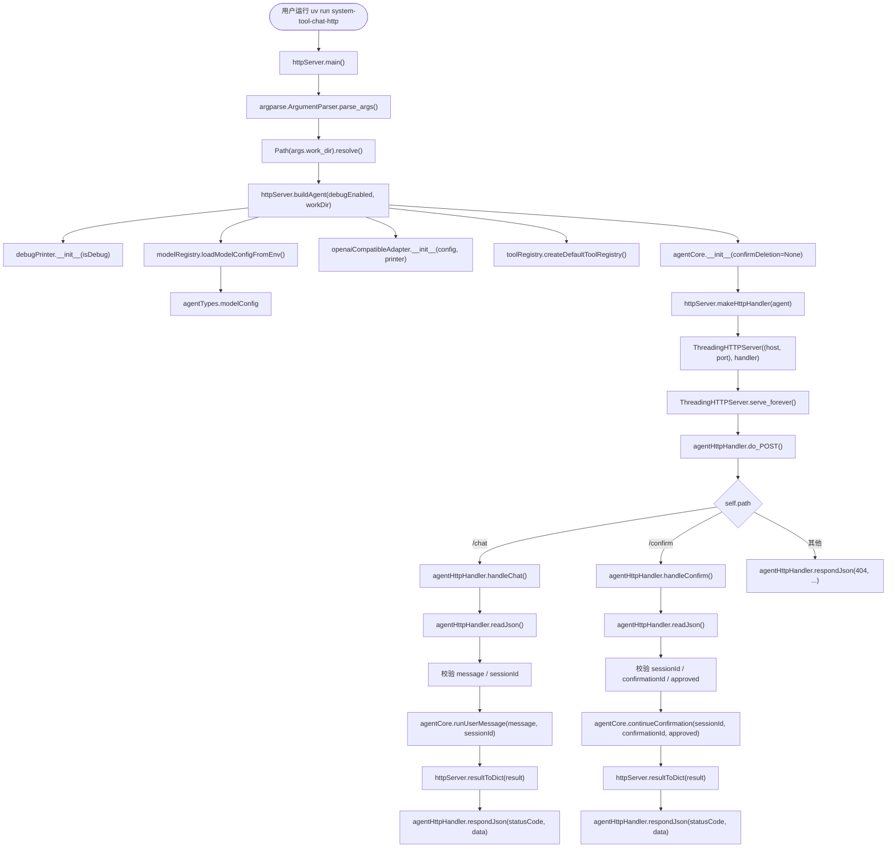

### HTTP 读码顺序

```text
1. httpServer.main()
2. httpServer.buildAgent()
3. httpServer.makeHttpHandler()
4. agentHttpHandler.do_POST()
5. agentHttpHandler.handleChat()
6. agentHttpHandler.handleConfirm()
7. agentCore.runUserMessage()
8. agentCore.continueConfirmation()
```

---

## 2.3 `agentCore.runUserMessage()` 会话入口流程

这部分看所有用户消息进入核心后的第一段逻辑。  
结论：它负责清洗输入、创建或复用 session、写入用户消息，然后进入模型循环。

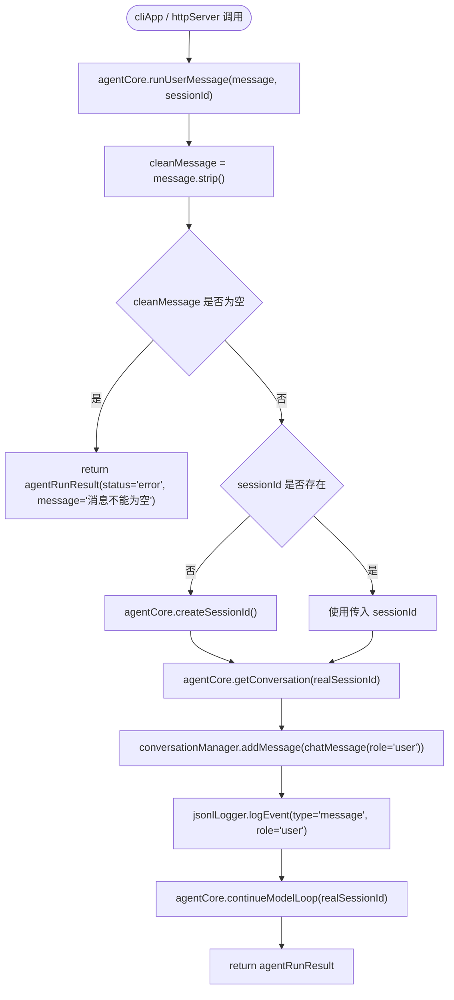

### 这块对应的关键状态

| 状态 | 存在哪里 | 说明 |
|---|---|---|
| `sessionId` | `agentRunResult.sessionId` | 会话 ID |
| 对话消息 | `conversationManager.messages` | 当前内存会话 |
| 会话字典 | `agentCore.conversations` | `sessionId -> conversationManager` |
| 日志文件 | `.agentLogs/YYYYMMDD_sessionId.jsonl` | JSONL 审计日志 |

---

## 2.4 `agentCore.getConversation()` 会话创建流程

这部分看 session 如何落到内存和日志文件。  
结论：第一次使用 session 时创建 `conversationManager`，并自动写入 system prompt。

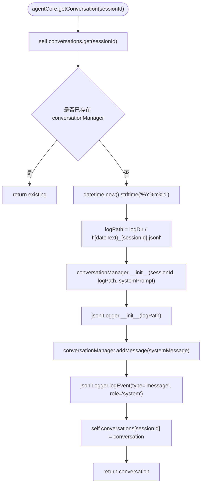

---

## 2.5 `agentCore.continueModelLoop()` 主循环流程

这是项目最核心的函数。  
结论：它不断调用模型；如果模型不再要求工具调用，就返回最终自然语言结果；如果模型要求工具调用，就执行工具后把结果追加回消息列表，再继续调用模型。

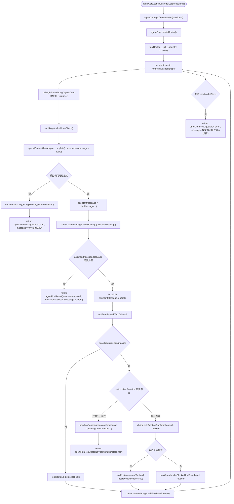

### 这个函数最重要的分叉

| 分叉 | 条件 | 结果 |
|---|---|---|
| 模型没有工具调用 | `not assistantMessage.toolCalls` | 返回 `completed` |
| 普通工具调用 | 不需要删除确认 | 执行工具，追加 tool message，继续循环 |
| CLI 删除命令 | `confirmDeletion` 存在 | 现场问用户 y/N |
| HTTP 删除命令 | `confirmDeletion is None` | 返回 `confirmationRequired` |
| 模型异常 | adapter 抛异常 | 写 `modelError` 日志，返回 `error` |
| 循环过多 | 超过 `maxModelSteps` | 返回 `error` |

---

## 2.6 模型调用流程：`openaiCompatibleAdapter.complete()`

这部分看内部消息如何变成 OpenAI-compatible 请求。  
结论：adapter 只负责协议转换，不负责会话、不负责工具执行。

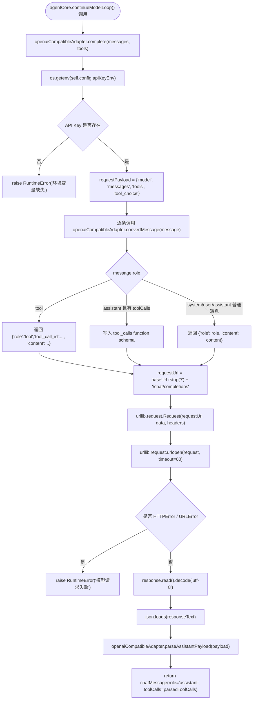

---

## 2.7 模型响应解析流程：`parseAssistantPayload()`

这部分看模型返回的 `tool_calls` 如何转成内部 `toolCall`。  
结论：OpenAI 格式里的 `function.name` 和 `function.arguments` 会被解析为内部 `toolCall.toolName` 和 `toolCall.arguments`。

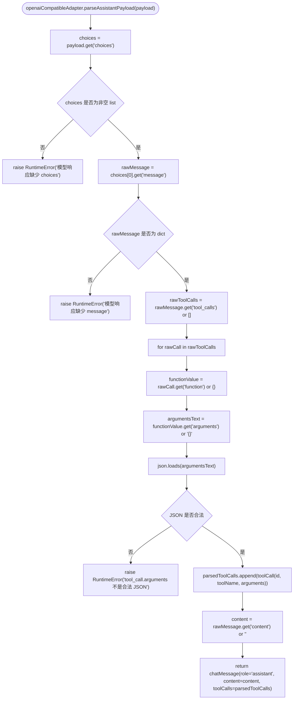

---

## 2.8 工具注册流程：`createDefaultToolRegistry()`

这部分看系统有哪些工具。  
结论：第一版只有四个工具：`read`、`write`、`edit`、`bash`。`curl/python/grep/open` 都不是单独工具，只能通过 `bash` 执行。

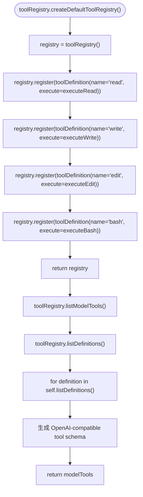

---

## 2.9 工具路由流程：`toolRouter.executeTool()`

这部分看工具调用如何从统一入口分发到具体工具函数。  
结论：所有工具都必须经过 `toolRouter.executeTool()`，并且 bash 删除命令会再次被 guard 检查。

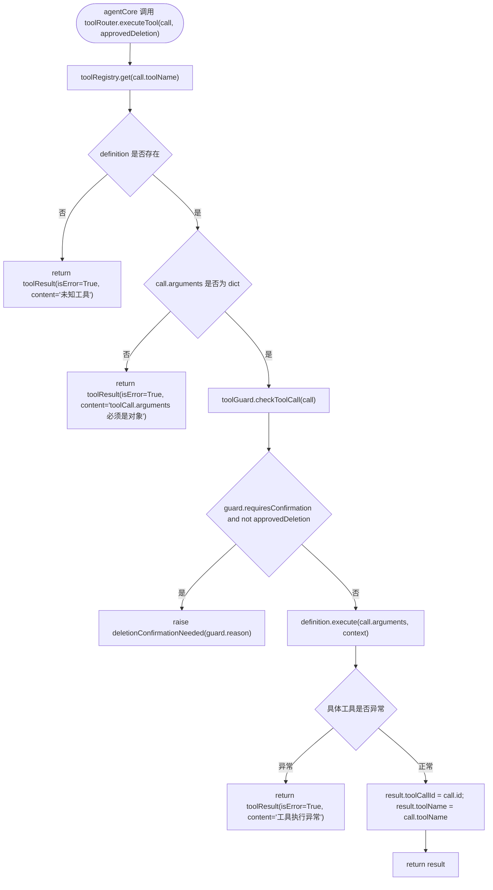

---

## 2.10 文件工具流程：`read/write/edit`

这部分看 `fileTools.py`。  
结论：`read` 读文本，`write` 覆盖写入，`edit` 要求 `oldText` 唯一匹配并返回 unified diff。

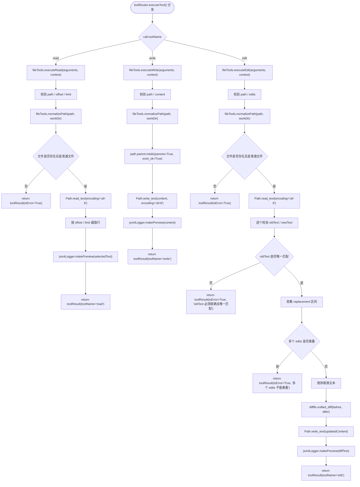

---

## 2.11 Bash 工具流程：`executeBash()`

这部分看 `bashTool.py`。  
结论：`bash` 实际用 `subprocess.run(['bash', '-lc', command])` 执行，支持超时、stdout/stderr 捕获、输出截断。

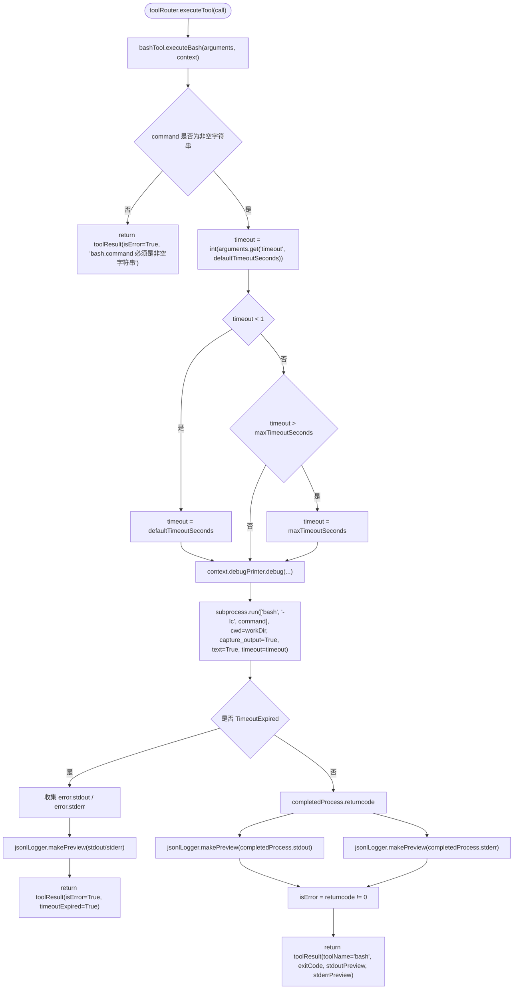

---

## 2.12 删除命令检测和确认流程

这部分看安全拦截。  
结论：删除命令不在工具层直接执行，必须先经过 `toolGuard.checkToolCall()`。CLI 会现场询问；HTTP 会返回 `confirmationRequired`。

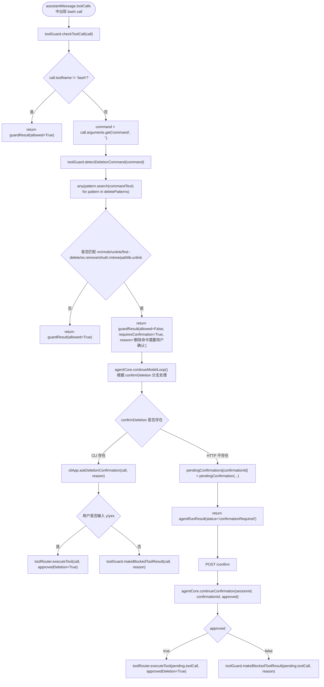

---

## 2.13 HTTP `/confirm` 继续执行流程

这部分单独看 HTTP 删除确认后的继续执行。  
结论：`/confirm` 不重新生成工具调用，而是使用之前挂起的 `pendingConfirmation.toolCall`。

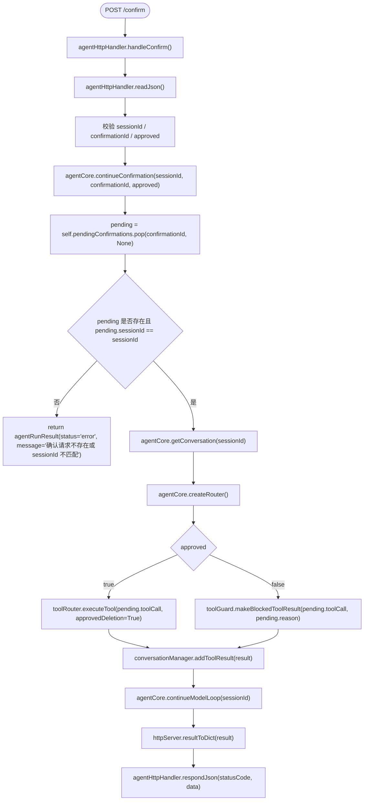

---

## 2.14 会话日志流程：`conversationManager` + `jsonlLogger`

这部分看所有关键事件如何写进 JSONL。  
结论：消息、工具调用、工具结果、模型错误都会写日志；日志写入前会做脱敏和预览截断。

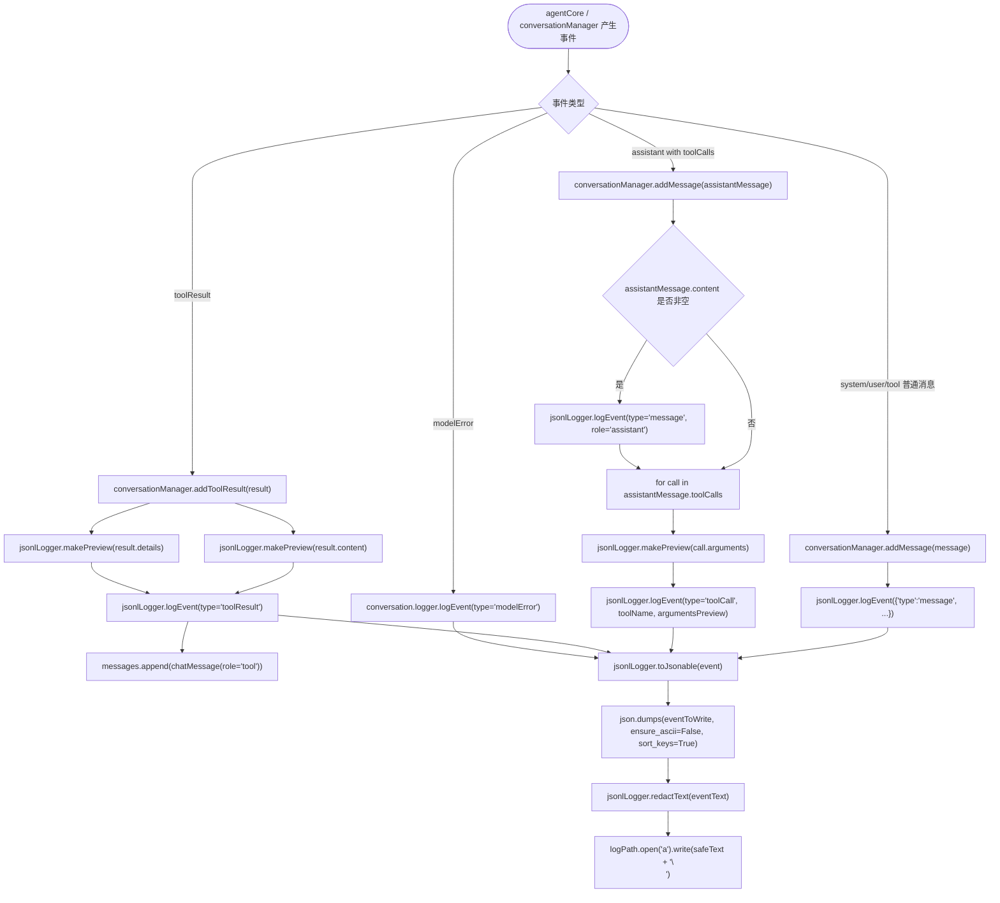

---

## 2.15 JSONL 脱敏和截断流程

这部分看日志安全处理。  
结论：`makePreview()` 先转字符串，再脱敏，再按长度截断；`logEvent()` 最终写入前也会再次脱敏。

```mermaid
flowchart TD
    start(["jsonlLogger.makePreview(value, limit=4000)"]) --> typeCheck{value 是否为 str}
    typeCheck -->|是| rawText["rawText = value"]
    typeCheck -->|否| toJsonable["jsonlLogger.toJsonable(value)"]
    toJsonable --> dumps["json.dumps(..., ensure_ascii=False, sort_keys=True)"]
    dumps --> rawText
    rawText --> redactText["jsonlLogger.redactText(rawText)"]
    redactText --> pattern1["secretPatterns[0]: api_key/token/secret/password"]
    pattern1 --> pattern2["secretPatterns[1]: bearer token"]
    pattern2 --> pattern3["secretPatterns[2]: sk-..."]
    pattern3 --> lengthCheck{len(redactedText) <= limit}
    lengthCheck -->|是| returnFull["return redactedText, False"]
    lengthCheck -->|否| returnTruncated["return redactedText[:limit] + '<truncated>', True"]
    logEventStart["jsonlLogger.logEvent(event)"] --> addTimestamp["eventToWrite = {'timestamp': now, **event}"]
    addTimestamp --> eventDumps["json.dumps(eventToWrite, ...)"]
    eventDumps --> finalRedact["jsonlLogger.redactText(eventText)"]
    finalRedact --> writeFile["fileObj.write(safeText + '\\n')"]
```

---

## 2.16 一次普通工具调用的端到端时序

这个图用时序图展示：用户要求读文件，模型发出 `read` 工具调用，系统执行后再让模型总结。

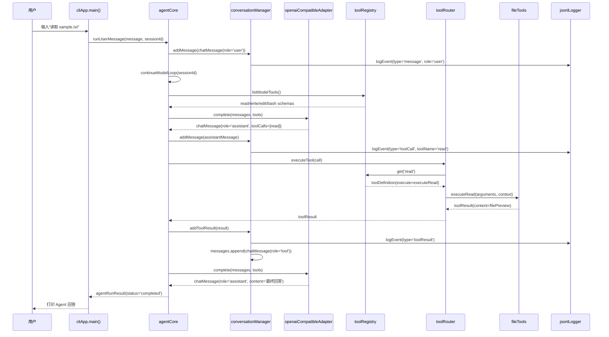

---

## 2.17 一次 HTTP 删除确认的端到端时序

这个图用时序图展示：HTTP 用户触发删除命令，系统先挂起，再通过 `/confirm` 继续。

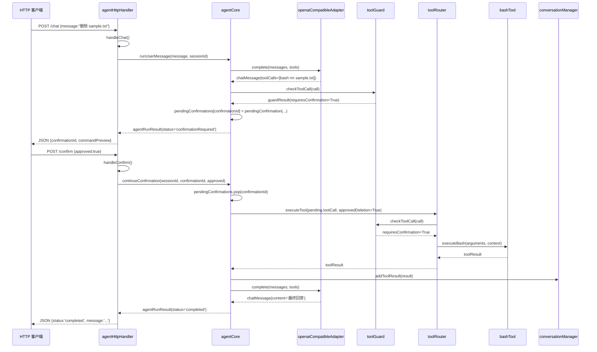

---

# 第三部分：建议阅读路径

## 3.1 只想看主干

按这个顺序读：

```text
1. pyproject.toml
2. systemToolChatAgent/cliApp.py
3. systemToolChatAgent/httpServer.py
4. systemToolChatAgent/agentCore.py
5. systemToolChatAgent/toolRouter.py
6. systemToolChatAgent/toolRegistry.py
7. systemToolChatAgent/fileTools.py
8. systemToolChatAgent/bashTool.py
9. systemToolChatAgent/openaiAdapter.py
```

---

## 3.2 只想看删除确认

按这个顺序读：

```text
1. systemToolChatAgent/toolGuard.py
2. systemToolChatAgent/agentCore.py
3. systemToolChatAgent/cliApp.py
4. systemToolChatAgent/httpServer.py
5. systemToolChatAgent/toolRouter.py
```

核心函数：

```text
toolGuard.detectDeletionCommand()
toolGuard.checkToolCall()
agentCore.continueModelLoop()
agentCore.continueConfirmation()
cliApp.askDeletionConfirmation()
toolRouter.executeTool()
```

---

## 3.3 只想看模型调用

按这个顺序读：

```text
1. systemToolChatAgent/modelRegistry.py
2. systemToolChatAgent/openaiAdapter.py
3. systemToolChatAgent/agentCore.py
4. systemToolChatAgent/toolRegistry.py
```

核心函数：

```text
modelRegistry.loadModelConfigFromEnv()
openaiCompatibleAdapter.complete()
openaiCompatibleAdapter.convertMessage()
openaiCompatibleAdapter.parseAssistantPayload()
toolRegistry.listModelTools()
agentCore.continueModelLoop()
```

---

## 3.4 只想看工具系统

按这个顺序读：

```text
1. systemToolChatAgent/toolRegistry.py
2. systemToolChatAgent/toolRouter.py
3. systemToolChatAgent/toolGuard.py
4. systemToolChatAgent/fileTools.py
5. systemToolChatAgent/bashTool.py
```

核心函数：

```text
toolRegistry.createDefaultToolRegistry()
toolRegistry.listModelTools()
toolRouter.executeTool()
toolGuard.checkToolCall()
fileTools.executeRead()
fileTools.executeWrite()
fileTools.executeEdit()
bashTool.executeBash()
```

---

# 第四部分：核心结论

## 4.1 入口层不做核心逻辑

```text
cliApp.py / httpServer.py
```

只负责：

```text
输入
参数解析
构造 agentCore
输出结果
HTTP JSON 包装
CLI 删除确认交互
```

---

## 4.2 `agentCore` 是唯一主脑

```text
agentCore.runUserMessage()
agentCore.continueModelLoop()
agentCore.continueConfirmation()
```

这三个函数控制：

```text
会话
模型调用
工具调用
删除确认
循环继续
最终返回
```

---

## 4.3 工具执行必须经过 router

```text
toolRouter.executeTool()
```

它负责：

```text
找工具
校验参数对象
再次经过 toolGuard
执行具体工具函数
捕获异常
标准化 toolResult
```

---

## 4.4 删除命令确认是双层保护

第一层在：

```text
agentCore.continueModelLoop()
```

第二层在：

```text
toolRouter.executeTool()
```

所以即使有路径绕过了 `agentCore` 的前置判断，只要还走 `toolRouter.executeTool()`，删除命令仍然会被检查。

---

## 4.5 日志是旁路镜像，不参与业务决策

```text
conversationManager
jsonlLogger
```

负责把关键路径写入 `.agentLogs/*.jsonl`，但不决定模型如何回答，也不决定工具能否执行。

