<!--
Author: wilbur
Version: 1.4
Date: 2026-07-01
Description: Updates the Flamingo Agents flow documentation with verified code alignment and cleaner logic diagrams.
-->

# Flamingo Agents 完整流程图

> 范围：本文档基于 `flamingoAgents/`、`manualChecks.py`、`pyproject.toml`、`config/models.yaml` 的静态阅读整理；忽略 `__pycache__/` 与 `.venv/`。  
> 架构：采用“总览 → 分环节 → 函数索引”的总分结构。每个关键节点都标注代码文件与相关函数/类。  
> 入口：`pyproject.toml` 暴露两个命令：`flamingo-agents` 与 `flamingo-agents-server`。

---

## 0. 图例

| 图中写法 | 含义 |
| --- | --- |
| `文件路径::函数()` | 普通函数或方法调用点 |
| `文件路径::class.method()` | 类方法调用点 |
| `dataclass` | `flamingoAgents/core/types.py` 中的数据载体 |
| `status=completed` | `runResult.status` 最终完成 |
| `status=confirmationRequired` | HTTP 模式下删除命令等待用户确认 |
| `status=error` | 模型、参数、工具执行或循环上限错误 |

---

## 1. 总览架构

### 1.1 总览 Mermaid

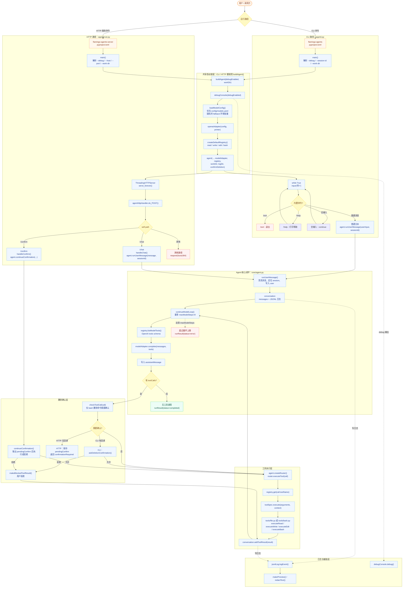

### 1.1.1 Agent 与工具注册的真实关系

| 阶段 | 代码文件 | 函数 / 方法 | 关键动作 |
| --- | --- | --- | --- |
| 创建注册表 | `flamingoAgents/tools/registry.py` | `createDefaultRegistry()` | 新建 `registry()`，连续注册 `read`、`write`、`edit`、`bash` 四个 `toolSpec` |
| 绑定执行函数 | `flamingoAgents/tools/registry.py` | `registry.register()` | 每个 `toolSpec.execute` 分别指向 `executeRead()`、`executeWrite()`、`executeEdit()`、`executeBash()` |
| 注入 Agent | `flamingoAgents/app/cli.py`、`flamingoAgents/app/server.py` | `buildAgent()` | 把 `registry` 作为构造参数传入 `core/agent.py::agent(...)` |
| Agent 持有注册表 | `flamingoAgents/core/agent.py` | `agent.__init__()` | `self.registry = registry`，后续模型工具 schema 与工具执行都靠它 |
| 暴露给模型 | `flamingoAgents/core/agent.py`、`flamingoAgents/tools/registry.py` | `agent.continueModelLoop()`、`registry.listModelTools()` | 每轮模型调用前，把注册表转换成 OpenAI `tools` schema 传给模型 |
| 执行模型工具调用 | `flamingoAgents/core/agent.py`、`flamingoAgents/tools/router.py` | `agent.createRouter()`、`router.executeTool()` | Router 拿同一份 `registry`，通过 `registry.get(call.toolName)` 找到具体工具执行函数 |

> 所以工具注册不是旁支，也不是 CLI/HTTP 各自的一套独立模块。它是共享模块：**CLI 和 HTTP 都调用同一个 `createDefaultRegistry()` 工厂函数，各自得到一个 registry 实例 → Agent 持有该 registry → 每轮模型调用把 registry 暴露成 tools schema → 模型返回 toolCall → router 从 Agent 持有的同一份 registry 找 execute 执行工具 → 工具结果回灌 Agent 会话。**

### 1.2 架构分层说明

| 层级 | 主要职责 | 代码文件 | 关键函数 / 类 |
| --- | --- | --- | --- |
| 入口层 | 接收 CLI 输入或 HTTP 请求，打印/返回 Agent 执行结果 | `flamingoAgents/app/cli.py`、`flamingoAgents/app/server.py` | `main()`、`makeHttpHandler()`、`agentHttpHandler.do_POST()`、`handleChat()`、`handleConfirm()` |
| 启动装配层 | 初始化 debug、模型配置、模型适配器、工具注册表、Agent 实例 | `cli.py`、`server.py`、`models/registry.py`、`models/openai.py`、`tools/registry.py` | `buildAgent()`、`loadModelConfig()`、`openaiAdapter.__init__()`、`createDefaultRegistry()` |
| 核心编排层 | 管理会话、调用模型、执行工具、处理删除确认、返回 `runResult` | `core/agent.py`、`core/conversation.py`、`core/types.py` | `agent.runUserMessage()`、`agent.continueModelLoop()`、`agent.continueConfirmation()`、`conversation.addMessage()`、`conversation.addToolResult()` |
| 模型层 | 把内部消息转成 OpenAI 兼容格式，请求 `/chat/completions`，解析 assistant/tool_calls | `models/openai.py` | `openaiAdapter.complete()`、`convertMessage()`、`parseAssistantPayload()` |
| 工具层 | 注册工具 schema、检查删除风险、路由并执行 `read/write/edit/bash` | `tools/registry.py`、`tools/router.py`、`tools/guard.py`、`tools/file.py`、`tools/bash.py` | `registry.listModelTools()`、`router.executeTool()`、`checkToolCall()`、`executeRead()`、`executeWrite()`、`executeEdit()`、`executeBash()` |
| 日志辅助层 | Debug 输出、JSONL 审计日志、内容预览、敏感信息脱敏 | `utils/debug.py`、`utils/jsonl.py` | `debugConsole.debug()`、`jsonlLog.logEvent()`、`makePreview()`、`redactText()` |
| 验证脚本 | 不依赖测试框架的手动检查 | `manualChecks.py` | `runFileToolCheck()`、`runBashCheck()`、`runGuardCheck()`、`runLoggerCheck()`、`runAdapterParseCheck()`、`runAgentCheck()`、`runHttpCheck()` |

---

## 2. 总流程：从用户输入到最终响应

### 2.1 端到端 Mermaid

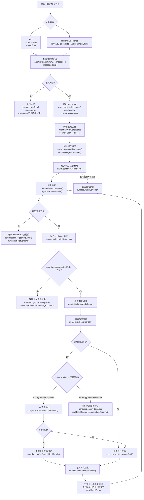

### 2.2 关键状态流转

| 阶段 | 输入 | 输出 | 代码文件 | 关键函数 / 类 |
| --- | --- | --- | --- | --- |
| 用户消息进入 | CLI 字符串或 HTTP JSON `message` | `cleanMessage` | `core/agent.py` | `agent.runUserMessage()` |
| 会话定位 | `sessionId` 可空 | 真实 `sessionId` 与 `conversation` | `core/agent.py`、`core/conversation.py` | `createSessionId()`、`getConversation()`、`conversation.__init__()` |
| 消息落会话 | `chatMessage(role='user')` | 内存消息列表 + JSONL 日志 | `core/conversation.py`、`utils/jsonl.py` | `conversation.addMessage()`、`jsonlLog.logEvent()` |
| 模型请求 | `conversation.messages` + 工具 schema | `chatMessage(role='assistant')` | `models/openai.py`、`tools/registry.py` | `openaiAdapter.complete()`、`registry.listModelTools()` |
| 工具调用判断 | `assistantMessage.toolCalls` | 直接完成或执行工具 | `core/agent.py` | `agent.continueModelLoop()` |
| 删除确认 | `toolCall(toolName='bash')` 且命中删除模式 | CLI 同步确认或 HTTP pending confirmation | `tools/guard.py`、`app/cli.py`、`core/agent.py` | `checkToolCall()`、`askDeletionConfirmation()`、`pendingConfirm` |
| 工具执行 | `toolCall.arguments` + `toolContext` | `toolResult` | `tools/router.py`、`tools/file.py`、`tools/bash.py` | `router.executeTool()`、`executeRead()`、`executeWrite()`、`executeEdit()`、`executeBash()` |
| 工具结果回灌 | `toolResult` | `chatMessage(role='tool')`，继续模型循环 | `core/conversation.py` | `conversation.addToolResult()` |
| 最终返回 | 无工具调用或错误 | `runResult` | `core/types.py` | `runResult` dataclass |

---

## 3. 分环节流程

## 3.1 CLI 入口流程

### Mermaid

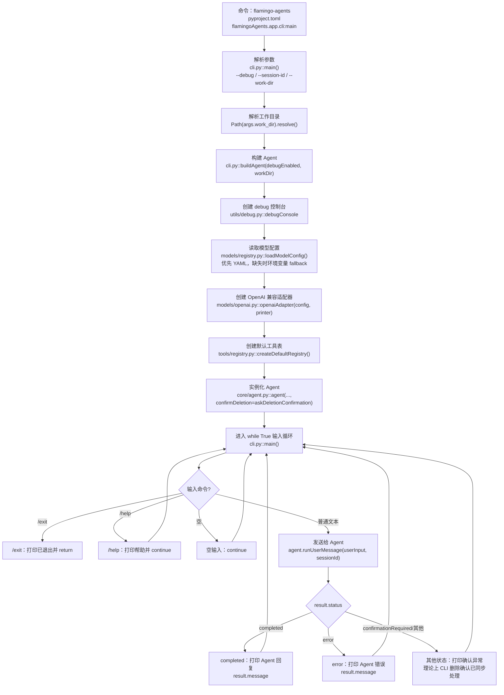

### 环节明细

| 顺序 | 环节 | 文件 | 函数 / 类 | 说明 |
| --- | --- | --- | --- | --- |
| 1 | 命令入口 | `pyproject.toml` | `[project.scripts] flamingo-agents` | 指向 `flamingoAgents.app.cli:main` |
| 2 | 参数解析 | `flamingoAgents/app/cli.py` | `main()` | 支持 `--debug`、`--session-id`、`--work-dir` |
| 3 | Agent 装配 | `flamingoAgents/app/cli.py` | `buildAgent()` | 创建 debug、加载模型配置、创建 adapter、创建默认工具表 |
| 4 | 模型配置 | `flamingoAgents/models/registry.py` | `loadModelConfig()` | 若 `config/models.yaml` 存在则走 `loadModelConfigFromYaml()`；否则走 `loadModelConfigFromEnv()` 校验环境变量 |
| 5 | 模型适配器 | `flamingoAgents/models/openai.py` | `openaiAdapter.__init__()` | 保存 `modelConfig` 与 debug 控制台 |
| 6 | 工具注册 | `flamingoAgents/tools/registry.py` | `createDefaultRegistry()` | 注册 `read`、`write`、`edit`、`bash` |
| 7 | 删除确认回调 | `flamingoAgents/app/cli.py` | `askDeletionConfirmation()` | CLI 模式直接用 `input()` 问用户是否允许删除命令 |
| 8 | 输入循环 | `flamingoAgents/app/cli.py` | `main()` | 处理 `/exit`、`/help`、空输入和普通消息 |
| 9 | 运行 Agent | `flamingoAgents/core/agent.py` | `agent.runUserMessage()` | 进入核心模型-工具循环 |

---

## 3.2 HTTP 入口流程

### Mermaid

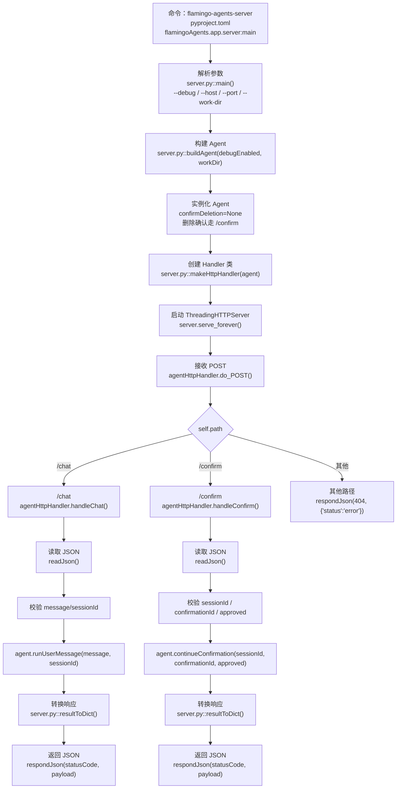

### 环节明细

| 顺序 | 环节 | 文件 | 函数 / 类 | 说明 |
| --- | --- | --- | --- | --- |
| 1 | 命令入口 | `pyproject.toml` | `[project.scripts] flamingo-agents-server` | 指向 `flamingoAgents.app.server:main` |
| 2 | 参数解析 | `flamingoAgents/app/server.py` | `main()` | 支持 `--debug`、`--host`、`--port`、`--work-dir` |
| 3 | Agent 装配 | `flamingoAgents/app/server.py` | `buildAgent()` | 与 CLI 类似，但 `confirmDeletion=None` |
| 4 | Handler 创建 | `flamingoAgents/app/server.py` | `makeHttpHandler(agent)` | 闭包捕获 `agent`，内部定义 `agentHttpHandler` |
| 5 | 路由分发 | `flamingoAgents/app/server.py` | `agentHttpHandler.do_POST()` | 只支持 `/chat`、`/confirm` |
| 6 | `/chat` 请求 | `flamingoAgents/app/server.py` | `handleChat()`、`readJson()` | 校验 `message` 必须非空字符串，`sessionId` 若传必须为字符串 |
| 7 | `/confirm` 请求 | `flamingoAgents/app/server.py` | `handleConfirm()`、`readJson()` | 校验 `sessionId`、`confirmationId`、`approved` |
| 8 | 响应转换 | `flamingoAgents/app/server.py` | `resultToDict()` | `confirmationRequired` 时追加 `confirmationId`、`reason`、`commandPreview` |
| 9 | JSON 响应 | `flamingoAgents/app/server.py` | `respondJson()` | 设置 `Content-Type: application/json; charset=utf-8` |
| 10 | 访问日志 | `flamingoAgents/app/server.py` | `log_message()` | 只有 debug 模式才调用父类日志输出 |

---

## 3.3 Agent 核心模型-工具循环

### Mermaid

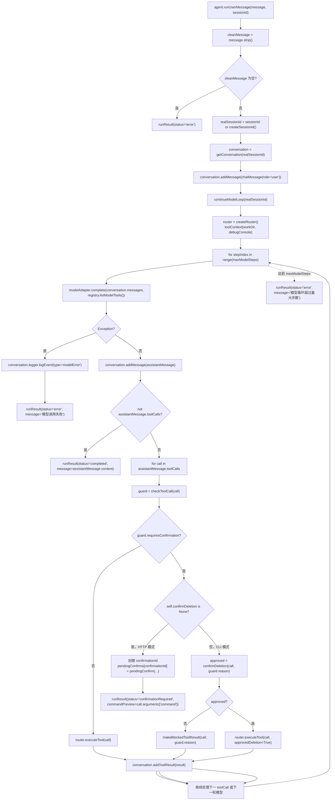

### 关键实现点

| 主题 | 文件 | 函数 / 类 | 细节 |
| --- | --- | --- | --- |
| 系统提示词 | `flamingoAgents/core/agent.py` | `systemPrompt` | 约束 Agent 可聊天、可调用 `read/write/edit/bash`；联网只能通过 bash/curl；删除命令必须确认 |
| Agent 状态 | `flamingoAgents/core/agent.py` | `agent.__init__()` | 保存 `modelAdapter`、`registry`、`workDir`、`logDir`、`debugConsole`、`confirmDeletion`、`maxModelSteps`、`conversations`、`pendingConfirms` |
| 会话创建 | `flamingoAgents/core/agent.py` | `getConversation()` | 日志路径为 `logDir / f'{dateText}_{sessionId}.jsonl'` |
| Router 创建 | `flamingoAgents/core/agent.py` | `createRouter()` | 构造 `toolContext(workDir=self.workDir, debugConsole=self.debugConsole)` 后返回 `router` |
| 空消息 | `flamingoAgents/core/agent.py` | `runUserMessage()` | 直接返回 `runResult(status='error')` |
| 模型循环 | `flamingoAgents/core/agent.py` | `continueModelLoop()` | 最多执行 `maxModelSteps` 轮，默认 8 |
| 模型异常 | `flamingoAgents/core/agent.py` | `continueModelLoop()` | 捕获后写入 `modelError` 日志，返回 `status='error'` |
| 无工具调用 | `flamingoAgents/core/agent.py` | `continueModelLoop()` | 返回 `status='completed'` |
| 有工具调用 | `flamingoAgents/core/agent.py` | `continueModelLoop()` | 逐个检查删除风险、执行工具、把结果回灌 conversation，再继续模型循环 |
| HTTP 待确认 | `flamingoAgents/core/agent.py` | `pendingConfirms`、`pendingConfirm` | `confirmDeletion=None` 时，创建 `confirm_<12 hex>` 并返回 `confirmationRequired` |
| CLI 同步确认 | `flamingoAgents/app/cli.py` | `askDeletionConfirmation()` | 用户输入 `y` 或 `yes` 才允许执行 |

---

## 3.4 删除确认与 `/confirm` 续跑流程

### Mermaid

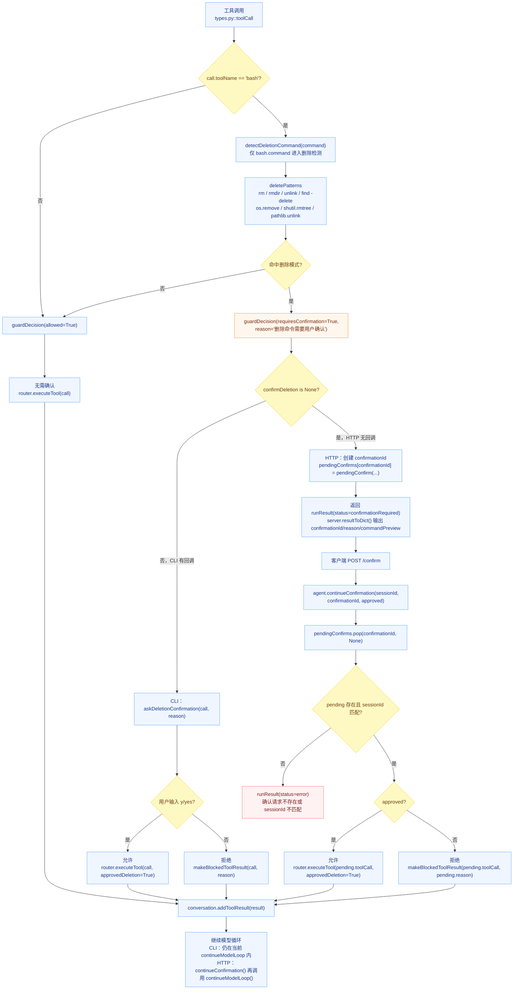

### 环节明细

| 环节 | 文件 | 函数 / 类 | 说明 |
| --- | --- | --- | --- |
| 删除模式定义 | `flamingoAgents/tools/guard.py` | `deletePatterns` | 用正则识别 shell 删除命令与 Python 删除 API |
| 删除检测 | `flamingoAgents/tools/guard.py` | `detectDeletionCommand()` | 空命令返回 `False`，否则任一模式命中即 `True` |
| 工具调用检查 | `flamingoAgents/tools/guard.py` | `checkToolCall()` | 非 `bash` 直接允许；`bash` 删除命令需要确认 |
| 拒绝结果 | `flamingoAgents/tools/guard.py` | `makeBlockedToolResult()` | 生成 `isError=True` 的 `toolResult`，内容说明命令被拒绝 |
| CLI 确认 | `flamingoAgents/app/cli.py` | `askDeletionConfirmation()` | 展示 command 与 reason，等待用户输入 |
| HTTP 待确认 | `flamingoAgents/core/agent.py` | `agent.continueModelLoop()`、`pendingConfirm` | 返回 `runResult(status='confirmationRequired')` |
| HTTP 续跑 | `flamingoAgents/core/agent.py` | `agent.continueConfirmation()` | 根据 `approved` 决定执行或拒绝，再继续模型循环 |
| Router 二次保护 | `flamingoAgents/tools/router.py` | `router.executeTool()`、`confirmationNeeded` | 若直接调用 router 且未传 `approvedDeletion=True`，仍会抛 `confirmationNeeded` |

---

## 3.5 模型适配流程

### Mermaid

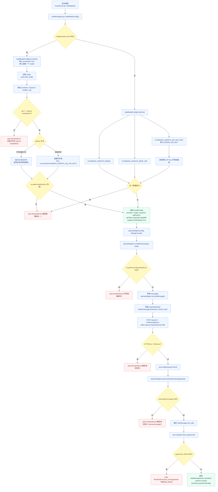

### 配置加载细节

| 分支 | 文件 | 函数 / 类 | 规则 |
| --- | --- | --- | --- |
| 主入口 | `flamingoAgents/models/registry.py` | `loadModelConfig()` | 先检查默认路径 `config/models.yaml`；存在则读 YAML，不存在才读环境变量 |
| YAML 配置 | `flamingoAgents/models/registry.py` | `loadModelConfigFromYaml()` | 默认 providerId 为 `101`，默认选择 provider 下第一个 model；只支持 `api: openai-completions` |
| API key 解析 | `flamingoAgents/models/registry.py` | `loadModelConfigFromYaml()` | `apiKey` 为 `${ENV}` 或 `$ENV` 时读取对应环境变量；普通字符串会写入自动生成的环境变量名 |
| 环境变量 fallback | `flamingoAgents/models/registry.py` | `loadModelConfigFromEnv()` | 校验 `FLAMINGO_AGENTS_MODEL`、`FLAMINGO_AGENTS_BASE_URL` 和 API key 环境变量 |
| 配置自检 | `flamingoAgents/models/registry.py` | `testModelConfig()` | 使用当前配置请求 `/chat/completions`，确认模型能返回 assistant 内容 |

### 数据转换细节

| 转换对象 | 文件 | 函数 / 类 | 规则 |
| --- | --- | --- | --- |
| 内部消息 → OpenAI 消息 | `flamingoAgents/models/openai.py` | `openaiAdapter.convertMessage()` | `role='tool'` 转为 `{role, tool_call_id, content}`；assistant 工具调用转为 `tool_calls` 数组 |
| 工具 schema | `flamingoAgents/tools/registry.py` | `registry.listModelTools()` | 每个 `toolSpec` 转为 OpenAI function tool schema |
| 请求 payload | `flamingoAgents/models/openai.py` | `openaiAdapter.complete()` | 包含 `model`、`messages`、`tools`、`tool_choice='auto'` |
| 响应 choices | `flamingoAgents/models/openai.py` | `openaiAdapter.parseAssistantPayload()` | 取 `choices[0].message` |
| tool_calls | `flamingoAgents/models/openai.py` | `openaiAdapter.parseAssistantPayload()` | 解析 `function.name` 为 `toolName`，`function.arguments` JSON 为 `arguments` |
| assistant 结果 | `flamingoAgents/core/types.py` | `chatMessage` | 返回 `chatMessage(role='assistant', content=..., toolCalls=...)` |

---

## 3.6 工具注册与路由流程

### Mermaid

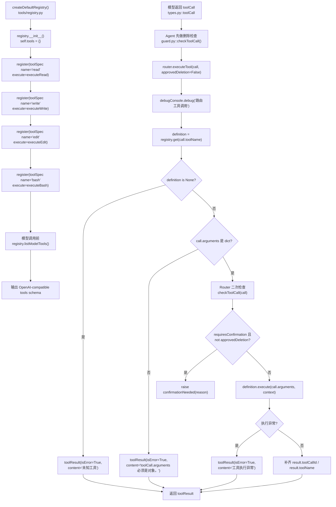

### 默认工具清单

| 工具名 | schema 定义位置 | 执行函数 | 参数 | 行为概述 |
| --- | --- | --- | --- | --- |
| `read` | `tools/registry.py::createDefaultRegistry()` | `tools/file.py::executeRead()` | `path` 必填，`offset`/`limit` 可选 | 读取本地文本文件片段 |
| `write` | `tools/registry.py::createDefaultRegistry()` | `tools/file.py::executeWrite()` | `path`、`content` 必填 | 创建或完整覆盖文本文件 |
| `edit` | `tools/registry.py::createDefaultRegistry()` | `tools/file.py::executeEdit()` | `path`、`edits` 必填 | 按唯一 `oldText` 精确替换，返回 diff 预览 |
| `bash` | `tools/registry.py::createDefaultRegistry()` | `tools/bash.py::executeBash()` | `command` 必填，`timeout` 可选 | 在 `workDir` 执行 bash 命令，捕获 stdout/stderr |

---

## 3.7 文件工具流程：read / write / edit

### Mermaid

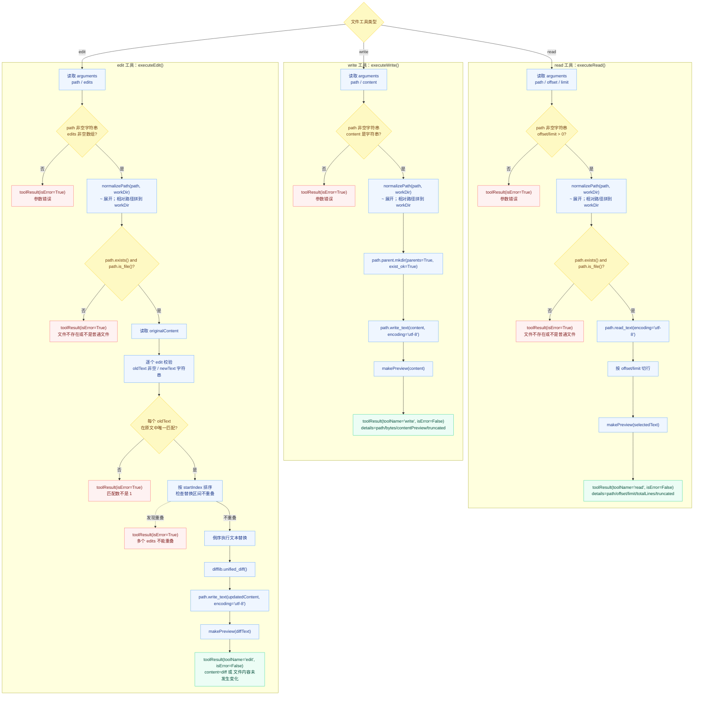

### 文件工具函数明细

| 函数 | 文件 | 输入 | 输出 | 重要约束 |
| --- | --- | --- | --- | --- |
| `normalizePath()` | `flamingoAgents/tools/file.py` | `pathValue: str`、`workDir: Path` | 绝对 `Path` | 相对路径以 `workDir` 为基准；支持 `~` 展开 |
| `executeRead()` | `flamingoAgents/tools/file.py` | `arguments`、`toolContext` | `toolResult` | `offset` 与 `limit` 必须大于 0；只读普通文件；返回预览 |
| `executeWrite()` | `flamingoAgents/tools/file.py` | `arguments`、`toolContext` | `toolResult` | `content` 必须是字符串；自动创建父目录；完整覆盖 |
| `executeEdit()` | `flamingoAgents/tools/file.py` | `arguments`、`toolContext` | `toolResult` | `edits` 非空；每个 `oldText` 在原文件中必须唯一；多个替换不能重叠 |

---

## 3.8 Bash 工具流程

### Mermaid

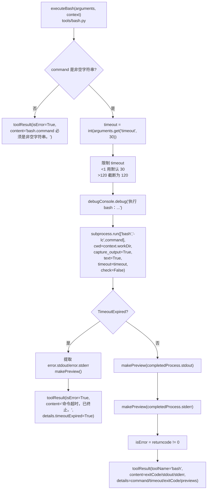

### 关键规则

| 规则 | 文件 | 函数 / 常量 | 说明 |
| --- | --- | --- | --- |
| 默认超时 | `flamingoAgents/tools/bash.py` | `defaultTimeoutSeconds = 30` | 未传或非法小于 1 时使用 30 秒 |
| 最大超时 | `flamingoAgents/tools/bash.py` | `maxTimeoutSeconds = 120` | 超过 120 秒会被截断 |
| 工作目录 | `flamingoAgents/tools/bash.py` | `executeBash()` | `cwd=str(context.workDir)` |
| 输出捕获 | `flamingoAgents/tools/bash.py` | `executeBash()` | 捕获 stdout/stderr，返回预览文本 |
| 错误判定 | `flamingoAgents/tools/bash.py` | `executeBash()` | `returncode != 0` 即 `isError=True` |
| 超时处理 | `flamingoAgents/tools/bash.py` | `executeBash()` | 捕获 `subprocess.TimeoutExpired`，返回 `timeoutExpired=True` |

---

## 3.9 会话与 JSONL 日志流程

### Mermaid

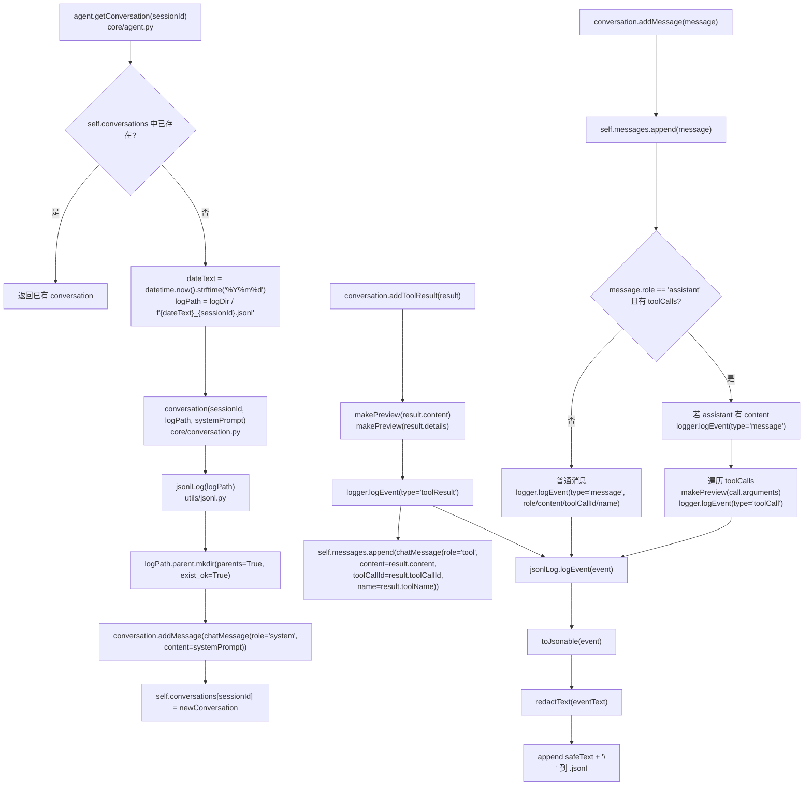

### 日志事件类型

| 事件类型 | 写入位置 | 文件 | 函数 | 内容 |
| --- | --- | --- | --- | --- |
| `message` | system/user/assistant 普通消息 | `core/conversation.py` | `conversation.addMessage()` | `role`、`content`、`toolCallId`、`name` |
| `toolCall` | assistant 发起工具调用 | `core/conversation.py` | `conversation.addMessage()` | `toolCallId`、`toolName`、`argumentsPreview`、`argumentsTruncated` |
| `toolResult` | 工具执行结果 | `core/conversation.py` | `conversation.addToolResult()` | `toolCallId`、`toolName`、`isError`、content/details 预览 |
| `modelError` | 模型调用异常 | `core/agent.py` | `agent.continueModelLoop()` | `errorType`、`message` |
| 自定义预览事件 | 目前未在主链路调用 | `utils/jsonl.py` | `jsonlLog.logPreviewEvent()` | `payloadPreview`、`truncated` |

### 脱敏与预览

| 函数 / 常量 | 文件 | 作用 |
| --- | --- | --- |
| `previewLimit = 4000` | `flamingoAgents/utils/jsonl.py` | 默认预览长度限制 |
| `secretPatterns` | `flamingoAgents/utils/jsonl.py` | 识别 `api_key/token/secret/password`、`Bearer ...`、`sk-...` |
| `redactText()` | `flamingoAgents/utils/jsonl.py` | 替换敏感文本为 `<redacted>` 或 `sk-<redacted>` |
| `toJsonable()` | `flamingoAgents/utils/jsonl.py` | dataclass、Path、dict、list 转 JSON 可序列化对象 |
| `makePreview()` | `flamingoAgents/utils/jsonl.py` | 先 JSON 化/转字符串，再脱敏，再按长度截断 |
| `jsonlLog.logEvent()` | `flamingoAgents/utils/jsonl.py` | 加 UTC `timestamp`，脱敏后追加写入 `.jsonl` |

---

## 3.10 数据结构流转

### Mermaid

```mermaid
flowchart LR
    modelConfig["modelConfig<br/>core/types.py<br/>provider/model/baseUrl/apiKeyEnv/apiType/supportsToolCalling"]
    adapter["openaiAdapter<br/>models/openai.py"]

    toolSpec["toolSpec<br/>name/description/parameters/execute"]
    registry["registry<br/>tools/registry.py<br/>tools: dict[str, toolSpec]"]
    modelTools["OpenAI tools schema<br/>registry.listModelTools()"]

    chatMessage["chatMessage<br/>role/content/toolCalls/toolCallId/name"]
    toolCall["toolCall<br/>id/toolName/arguments"]
    toolResult["toolResult<br/>toolCallId/toolName/isError/content/details"]
    toolContext["toolContext<br/>workDir/debugConsole"]

    pendingConfirm["pendingConfirm<br/>sessionId/confirmationId/reason/toolCall"]
    runResult["runResult<br/>sessionId/status/message/confirmationId/reason/commandPreview/toolCall"]

    conversation["conversation<br/>messages: list[chatMessage]"]
    agent["agent<br/>conversations/pendingConfirms"]
    router["router<br/>registry/context"]

    modelConfig --> adapter
    toolSpec --> registry --> modelTools --> adapter
    chatMessage --> adapter
    adapter --> chatMessage
    chatMessage --> toolCall
    toolCall --> pendingConfirm
    toolCall --> router
    toolContext --> router
    router --> toolResult
    toolResult --> chatMessage
    chatMessage --> conversation
    conversation --> agent
    pendingConfirm --> agent
    agent --> runResult
```

### 数据结构表

| 类型 | 文件 | 字段 | 用途 |
| --- | --- | --- | --- |
| `toolCall` | `flamingoAgents/core/types.py` | `id`、`toolName`、`arguments` | 表示模型要求执行的单个工具调用 |
| `chatMessage` | `flamingoAgents/core/types.py` | `role`、`content`、`toolCalls`、`toolCallId`、`name` | 内部统一消息格式 |
| `toolResult` | `flamingoAgents/core/types.py` | `toolCallId`、`toolName`、`isError`、`content`、`details` | 工具执行结果，随后转为 `role='tool'` 的消息 |
| `toolContext` | `flamingoAgents/core/types.py` | `workDir`、`debugConsole` | 工具执行依赖的上下文 |
| `toolSpec` | `flamingoAgents/core/types.py` | `name`、`description`、`parameters`、`execute` | 工具定义与执行函数绑定 |
| `modelConfig` | `flamingoAgents/core/types.py` | `provider`、`model`、`baseUrl`、`apiKeyEnv`、`apiType`、`supportsToolCalling` | 模型适配器配置 |
| `runResult` | `flamingoAgents/core/types.py` | `sessionId`、`status`、`message`、`confirmationId`、`reason`、`commandPreview`、`toolCall` | Agent 对入口层返回的统一结果 |
| `pendingConfirm` | `flamingoAgents/core/types.py` | `sessionId`、`confirmationId`、`reason`、`toolCall` | HTTP 删除确认暂存数据 |
| `guardDecision` | `flamingoAgents/tools/guard.py` | `allowed`、`requiresConfirmation`、`reason` | 删除风险判断结果 |

---

## 3.11 Debug 输出流程

### Mermaid

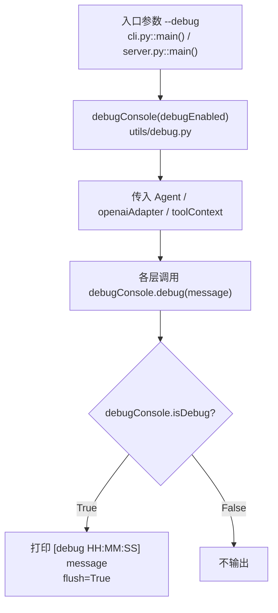

### 主要调用位置

| 位置 | 文件 | 函数 | 输出内容 |
| --- | --- | --- | --- |
| CLI 启动 | `flamingoAgents/app/cli.py` | `main()` | `CLI 启动 workDir=... sessionId=...` |
| HTTP POST | `flamingoAgents/app/server.py` | `agentHttpHandler.do_POST()` | 请求路径 |
| HTTP chat/confirm | `flamingoAgents/app/server.py` | `handleChat()`、`handleConfirm()` | sessionId、confirmationId、approved 等 |
| 用户消息 | `flamingoAgents/core/agent.py` | `agent.runUserMessage()` | sessionId 与消息字符数 |
| 模型循环 | `flamingoAgents/core/agent.py` | `agent.continueModelLoop()` | step、sessionId、消息数、工具数 |
| 工具执行 | `flamingoAgents/core/agent.py`、`tools/router.py`、`tools/bash.py`、`tools/file.py` | 多处 | 工具名、callId、读写路径、bash 命令等 |
| 模型请求 | `flamingoAgents/models/openai.py` | `openaiAdapter.complete()` | provider、model、消息数、工具数、URL |

---

## 3.12 手动验证流程

### Mermaid

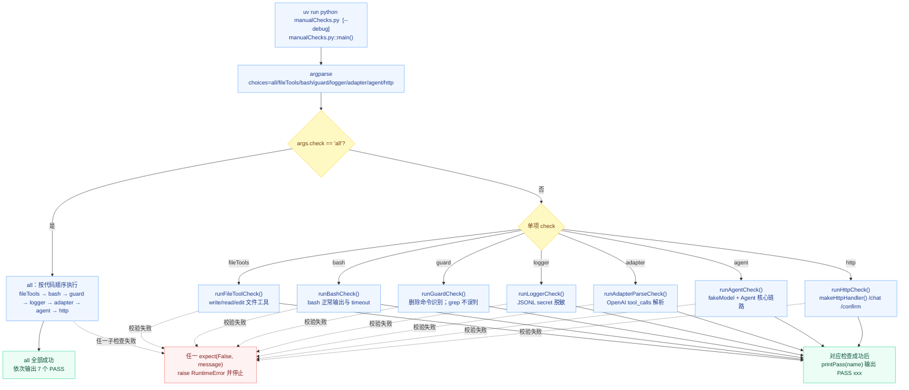

### 验证覆盖点

| 检查函数 | 文件 | 覆盖模块 | 重点断言 |
| --- | --- | --- | --- |
| `fakeModel.complete()` | `manualChecks.py` | Agent 模型交互替身 | 根据最后一条消息返回普通回复、工具调用或失败说明 |
| `runFileToolCheck()` | `manualChecks.py` | `tools/file.py` | write/read/edit 无错误且文件内容变化正确 |
| `runBashCheck()` | `manualChecks.py` | `tools/bash.py` | `printf hello` 成功；`sleep 2` 在 1 秒 timeout 下超时 |
| `runGuardCheck()` | `manualChecks.py` | `tools/guard.py` | 删除命令命中；`grep` 不应误判 |
| `runLoggerCheck()` | `manualChecks.py` | `utils/jsonl.py` | `sk-...` 被脱敏，原文不泄露 |
| `runAdapterParseCheck()` | `manualChecks.py` | `models/openai.py` | `tool_calls` 的 name 与 arguments 能正确解析 |
| `buildFakeAgent()` | `manualChecks.py` | `core/agent.py` | 使用 `fakeModel` 和默认工具注册表构造 Agent |
| `runAgentCheck()` | `manualChecks.py` | 核心 Agent 链路 | 读文件完成、删除需要确认、拒绝后文件仍存在、curl 失败不绕过 |
| `runHttpCheck()` | `manualChecks.py` | HTTP 链路 | `/chat` 返回 `confirmationRequired`，`/confirm` 拒绝后完成且文件仍存在 |

---

## 4. 完整调用链清单

### 4.1 CLI 完整链路

```text
pyproject.toml
└── flamingo-agents = flamingoAgents.app.cli:main
    └── flamingoAgents/app/cli.py::main()
        ├── argparse.ArgumentParser(...)
        ├── buildAgent(debugEnabled, workDir)
        │   ├── utils/debug.py::debugConsole(debugEnabled)
        │   ├── models/registry.py::loadModelConfig()
        │   ├── models/openai.py::openaiAdapter(config, printer)
        │   ├── tools/registry.py::createDefaultRegistry()
        │   │   └── registry.register(toolSpec(...)) x 4
        │   └── core/agent.py::agent(..., confirmDeletion=askDeletionConfirmation)
        ├── input('你> ')
        ├── /exit / /help / 空输入处理
        └── core/agent.py::agent.runUserMessage(userInput, sessionId)
            └── core/agent.py::agent.continueModelLoop(sessionId)
```

### 4.2 HTTP 完整链路

```text
pyproject.toml
└── flamingo-agents-server = flamingoAgents.app.server:main
    └── flamingoAgents/app/server.py::main()
        ├── argparse.ArgumentParser(...)
        ├── buildAgent(debugEnabled, workDir)
        │   ├── utils/debug.py::debugConsole(debugEnabled)
        │   ├── models/registry.py::loadModelConfig()
        │   ├── models/openai.py::openaiAdapter(config, printer)
        │   ├── tools/registry.py::createDefaultRegistry()
        │   └── core/agent.py::agent(..., confirmDeletion=None)
        ├── makeHttpHandler(agent)
        │   └── class agentHttpHandler(BaseHTTPRequestHandler)
        │       ├── do_POST()
        │       ├── handleChat()
        │       │   └── agent.runUserMessage(message, sessionId)
        │       ├── handleConfirm()
        │       │   └── agent.continueConfirmation(sessionId, confirmationId, approved)
        │       ├── readJson()
        │       ├── respondJson(statusCode, payload)
        │       └── log_message(format, *args)
        └── ThreadingHTTPServer(...).serve_forever()
```

### 4.3 Agent + 模型 + 工具完整链路

```text
core/agent.py::agent.runUserMessage()
├── createSessionId()                       # sessionId 为空时
├── getConversation(sessionId)
│   └── core/conversation.py::conversation.__init__()
│       ├── utils/jsonl.py::jsonlLog(logPath)
│       └── conversation.addMessage(system message)
├── conversation.addMessage(user message)
└── continueModelLoop(sessionId)
    ├── createRouter()
    │   └── tools/router.py::router(registry, toolContext(...))
    ├── registry.listModelTools()
    ├── modelAdapter.complete(messages, tools)
    │   ├── openaiAdapter.convertMessage(message) x N
    │   ├── urllib.request.urlopen(.../chat/completions)
    │   └── openaiAdapter.parseAssistantPayload(payload)
    ├── conversation.addMessage(assistantMessage)
    ├── 如果没有 toolCalls：return runResult(status='completed')
    └── 如果存在 toolCalls：for call in assistantMessage.toolCalls
        ├── tools/guard.py::checkToolCall(call)
        ├── 如果需要确认：
        │   ├── CLI：app/cli.py::askDeletionConfirmation(call, reason)
        │   └── HTTP：保存 pendingConfirm 并 return confirmationRequired
        ├── tools/router.py::router.executeTool(call, approvedDeletion=...)
        │   ├── registry.get(call.toolName)
        │   ├── checkToolCall(call)          # 二次保护
        │   ├── definition.execute(arguments, context)
        │   │   ├── tools/file.py::executeRead()
        │   │   ├── tools/file.py::executeWrite()
        │   │   ├── tools/file.py::executeEdit()
        │   │   └── tools/bash.py::executeBash()
        │   └── 返回 toolResult
        ├── conversation.addToolResult(result)
        └── 回到下一轮 modelAdapter.complete(...)
```

---

## 5. 文件与函数索引

### 5.1 `flamingoAgents/app/cli.py`

| 函数 | 行号 | 作用 | 被谁调用 / 调谁 |
| --- | ---: | --- | --- |
| `askDeletionConfirmation(call, reason)` | 21 | CLI 删除命令确认 | 被 `agent.continueModelLoop()` 通过回调调用；读取 `toolCall.arguments['command']` |
| `buildAgent(debugEnabled, workDir)` | 30 | CLI Agent 装配 | 调 `debugConsole()`、`loadModelConfig()`、`openaiAdapter()`、`createDefaultRegistry()`、`agent()` |
| `main()` | 45 | CLI 主入口 | 解析参数，循环读取输入，调用 `agent.runUserMessage()` |

### 5.2 `flamingoAgents/app/server.py`

| 函数 / 方法 | 行号 | 作用 | 被谁调用 / 调谁 |
| --- | ---: | --- | --- |
| `resultToDict(result)` | 23 | `runResult` 转 HTTP JSON dict | 被 `handleChat()`、`handleConfirm()` 调用 |
| `makeHttpHandler(agent)` | 38 | 创建绑定 Agent 的 `BaseHTTPRequestHandler` 子类 | 被 `main()` 调用 |
| `agentHttpHandler.do_POST()` | 42 | HTTP POST 路由 | 调 `handleChat()`、`handleConfirm()`、`respondJson()` |
| `agentHttpHandler.handleChat()` | 53 | 处理 `/chat` | 调 `readJson()`、`agent.runUserMessage()`、`resultToDict()`、`respondJson()` |
| `agentHttpHandler.handleConfirm()` | 69 | 处理 `/confirm` | 调 `readJson()`、`agent.continueConfirmation()`、`resultToDict()`、`respondJson()` |
| `agentHttpHandler.readJson()` | 89 | 读取 JSON body | 被 `handleChat()`、`handleConfirm()` 调用 |
| `agentHttpHandler.respondJson()` | 98 | 写 HTTP JSON 响应 | 被各 handler 调用 |
| `agentHttpHandler.log_message()` | 106 | 控制访问日志输出 | debug 时调用父类日志 |
| `buildAgent(debugEnabled, workDir)` | 113 | HTTP Agent 装配 | 与 CLI 类似，但 `confirmDeletion=None` |
| `main()` | 128 | HTTP 服务入口 | 创建 `ThreadingHTTPServer` 并 `serve_forever()` |

### 5.3 `flamingoAgents/core/agent.py`

| 函数 / 方法 / 常量 | 行号 | 作用 | 被谁调用 / 调谁 |
| --- | ---: | --- | --- |
| `systemPrompt` | 29 | Agent 系统提示词 | `conversation.__init__()` 通过 `getConversation()` 获得 |
| `agent.__init__()` | 33 | 保存核心依赖与状态 | 被 CLI/HTTP `buildAgent()` 调用 |
| `agent.runUserMessage(message, sessionId)` | 53 | 接收用户消息并启动循环 | 被 CLI `main()`、HTTP `handleChat()` 调用 |
| `agent.continueConfirmation(sessionId, confirmationId, approved)` | 64 | HTTP 删除确认后续跑 | 被 HTTP `handleConfirm()` 调用；调 `router.executeTool()`、`makeBlockedToolResult()`、`continueModelLoop()` |
| `agent.continueModelLoop(sessionId)` | 80 | 模型-工具循环核心 | 调 `modelAdapter.complete()`、`conversation.addMessage()`、`checkToolCall()`、`router.executeTool()`、`conversation.addToolResult()` |
| `agent.getConversation(sessionId)` | 144 | 获取或创建会话 | 被 `runUserMessage()`、`continueConfirmation()`、`continueModelLoop()` 调用 |
| `agent.createRouter()` | 154 | 创建工具路由器 | 被 `continueConfirmation()`、`continueModelLoop()` 调用 |
| `agent.createSessionId()` | 158 | 生成 session id | 被 `runUserMessage()` 调用 |

### 5.4 `flamingoAgents/core/conversation.py`

| 函数 / 方法 | 行号 | 作用 | 被谁调用 / 调谁 |
| --- | ---: | --- | --- |
| `conversation.__init__(sessionId, logPath, systemPrompt)` | 17 | 初始化会话、日志器、系统消息 | 被 `agent.getConversation()` 调用 |
| `conversation.addMessage(message)` | 23 | 追加消息并写 JSONL 日志 | 被 `agent.runUserMessage()`、`agent.continueModelLoop()`、`conversation.__init__()` 调用 |
| `conversation.addToolResult(result)` | 52 | 记录工具结果并追加 tool 消息 | 被 `agent.continueModelLoop()`、`agent.continueConfirmation()` 调用 |

### 5.5 `flamingoAgents/core/types.py`

| 类型 / 别名 | 行号 | 作用 | 主要使用位置 |
| --- | ---: | --- | --- |
| `messageRole` | 14 | 消息角色 Literal | `chatMessage.role` |
| `agentStatus` | 15 | Agent 返回状态 Literal | `runResult.status` |
| `toolCall` | 19 | 工具调用数据 | 模型解析、guard、router、pendingConfirm |
| `chatMessage` | 26 | 统一聊天消息 | conversation、openaiAdapter、manualChecks fakeModel |
| `toolResult` | 35 | 工具执行结果 | router、tool implementations、conversation |
| `toolContext` | 44 | 工具上下文 | router、file/bash tools |
| `toolSpec` | 50 | 工具定义 | registry |
| `modelConfig` | 58 | 模型配置 | model registry、openaiAdapter |
| `runResult` | 68 | 入口层统一响应 | CLI/HTTP/agent |
| `pendingConfirm` | 79 | HTTP 删除确认暂存 | agent.pendingConfirms |

### 5.6 `flamingoAgents/models/registry.py`

| 函数 | 行号 | 作用 | 被谁调用 / 调谁 |
| --- | ---: | --- | --- |
| `loadModelConfig()` | 25 | 模型配置主入口 | 被 CLI/HTTP `buildAgent()` 调用；优先读 `config/models.yaml`，缺失时 fallback 到环境变量 |
| `testModelConfig()` | 31 | 测试当前模型配置是否可请求 `/chat/completions` | 调 `loadModelConfig()`、`urllib.request.urlopen()`；返回 assistant 内容 |
| `loadModelConfigFromEnv()` | 82 | 从环境变量加载模型配置并校验 | 被 `loadModelConfig()` fallback 调用；返回 `modelConfig` |
| `loadModelConfigFromYaml()` | 108 | 从 YAML provider/model 配置加载模型配置 | 被 `loadModelConfig()` 默认调用；校验 provider、model、api 与 apiKey |

### 5.7 `flamingoAgents/models/openai.py`

| 函数 / 方法 | 行号 | 作用 | 被谁调用 / 调谁 |
| --- | ---: | --- | --- |
| `openaiAdapter.__init__(config, debugConsole)` | 20 | 保存配置和 debug 控制台 | 被 CLI/HTTP `buildAgent()` 调用 |
| `openaiAdapter.complete(messages, tools)` | 24 | 发起 OpenAI 兼容 chat completions 请求 | 被 `agent.continueModelLoop()` 调用；调 `convertMessage()`、`parseAssistantPayload()` |
| `openaiAdapter.convertMessage(message)` | 63 | 内部消息转 OpenAI 消息 | 被 `complete()` 调用 |
| `openaiAdapter.parseAssistantPayload(payload)` | 88 | 解析模型响应为 `chatMessage` | 被 `complete()` 与 `manualChecks.runAdapterParseCheck()` 调用 |

### 5.8 `flamingoAgents/tools/registry.py`

| 函数 / 方法 | 行号 | 作用 | 被谁调用 / 调谁 |
| --- | ---: | --- | --- |
| `registry.__init__()` | 16 | 初始化工具字典 | 被 `createDefaultRegistry()` 调用 |
| `registry.register(definition)` | 19 | 注册一个 `toolSpec` | 被 `createDefaultRegistry()` 调用 |
| `registry.get(name)` | 22 | 按名称取工具定义 | 被 `router.executeTool()` 调用 |
| `registry.listDefinitions()` | 25 | 返回全部工具定义 | 被 `listModelTools()` 与 debug 日志使用 |
| `registry.listModelTools()` | 28 | 生成 OpenAI function tools schema | 被 `agent.continueModelLoop()` 调用 |
| `createDefaultRegistry()` | 42 | 创建并注册默认四个工具 | 被 CLI/HTTP `buildAgent()` 与 `manualChecks.buildFakeAgent()` 调用 |

### 5.9 `flamingoAgents/tools/router.py`

| 函数 / 方法 / 类 | 行号 | 作用 | 被谁调用 / 调谁 |
| --- | ---: | --- | --- |
| `confirmationNeeded` | 15 | Router 层删除确认异常 | `router.executeTool()` 在未批准删除时抛出 |
| `confirmationNeeded.__init__(reason)` | 16 | 保存确认原因 | Router 内部使用 |
| `router.__init__(registry, context)` | 22 | 保存工具表与上下文 | 被 `agent.createRouter()` 调用 |
| `router.executeTool(call, approvedDeletion=False)` | 26 | 校验、路由、执行工具 | 被 `agent.continueModelLoop()`、`agent.continueConfirmation()` 调用 |

### 5.10 `flamingoAgents/tools/guard.py`

| 函数 / 类型 / 常量 | 行号 | 作用 | 被谁调用 / 调谁 |
| --- | ---: | --- | --- |
| `guardDecision` | 17 | 删除风险判断结果 | `checkToolCall()` 返回 |
| `deletePatterns` | 23 | 删除命令正则列表 | 被 `detectDeletionCommand()` 使用 |
| `detectDeletionCommand(command)` | 34 | 判断命令是否疑似删除 | 被 `checkToolCall()` 与 `manualChecks.runGuardCheck()` 调用 |
| `checkToolCall(call)` | 41 | 判断工具调用是否需要确认 | 被 `agent.continueModelLoop()` 与 `router.executeTool()` 调用 |
| `makeBlockedToolResult(call, reason)` | 54 | 构造用户拒绝后的工具结果 | 被 `agent.continueModelLoop()`、`agent.continueConfirmation()` 调用 |

### 5.11 `flamingoAgents/tools/file.py`

| 函数 | 行号 | 作用 | 被谁调用 / 调谁 |
| --- | ---: | --- | --- |
| `normalizePath(pathValue, workDir)` | 18 | 规范化相对/绝对路径 | 被 `executeRead()`、`executeWrite()`、`executeEdit()` 调用 |
| `executeRead(arguments, context)` | 25 | 读取文本文件片段 | 被 `router.executeTool()` 间接调用 |
| `executeWrite(arguments, context)` | 63 | 写入文本文件 | 被 `router.executeTool()` 间接调用 |
| `executeEdit(arguments, context)` | 91 | 精确替换文本并生成 diff | 被 `router.executeTool()` 间接调用 |

### 5.12 `flamingoAgents/tools/bash.py`

| 函数 / 常量 | 行号 | 作用 | 被谁调用 / 调谁 |
| --- | ---: | --- | --- |
| `maxTimeoutSeconds` | 16 | bash 最大超时秒数 | `executeBash()` 使用 |
| `defaultTimeoutSeconds` | 17 | bash 默认超时秒数 | `executeBash()` 使用 |
| `executeBash(arguments, context)` | 20 | 执行 bash 命令并返回输出预览 | 被 `router.executeTool()` 间接调用；调 `subprocess.run()`、`makePreview()` |

### 5.13 `flamingoAgents/utils/debug.py`

| 函数 / 方法 / 类 | 行号 | 作用 | 被谁调用 / 调谁 |
| --- | ---: | --- | --- |
| `debugConsole` | 15 | Debug 输出控制器 | CLI/HTTP build、Agent、工具、模型使用 |
| `debugConsole.debug(message)` | 18 | debug 模式打印时间戳消息 | 被多模块调用 |
| `debugConsole.visible(message)` | 23 | 无条件打印消息 | 当前主链路未使用 |

### 5.14 `flamingoAgents/utils/jsonl.py`

| 函数 / 方法 / 常量 | 行号 | 作用 | 被谁调用 / 调谁 |
| --- | ---: | --- | --- |
| `previewLimit` | 17 | 默认预览长度 4000 | `makePreview()` 使用 |
| `secretPatterns` | 18 | 敏感信息正则 | `redactText()` 使用 |
| `redactText(text)` | 25 | 脱敏文本 | `makePreview()`、`jsonlLog.logEvent()` 调用 |
| `makePreview(value, limit=previewLimit)` | 33 | 生成安全预览并标记截断 | conversation、file/bash tools、jsonlLog 调用 |
| `toJsonable(value)` | 44 | 转 JSON 可序列化结构 | `makePreview()`、`jsonlLog.logEvent()` 调用 |
| `jsonlLog.__init__(logPath)` | 57 | 创建日志目录 | `conversation.__init__()` 调用 |
| `jsonlLog.logEvent(event)` | 61 | 写一行 JSONL 审计事件 | conversation、agent 调用 |
| `jsonlLog.logPreviewEvent(eventType, payload)` | 71 | 写预览事件 | 当前主链路未调用 |

### 5.15 `manualChecks.py`

| 函数 / 类 | 行号 | 作用 |
| --- | ---: | --- |
| `fakeModel` | 32 | 模拟模型适配器，根据最后一条消息返回固定响应或工具调用 |
| `fakeModel.complete()` | 33 | fake model 的核心分支逻辑 |
| `expect(condition, message)` | 70 | 断言失败时抛 `RuntimeError` |
| `printPass(name)` | 75 | 打印 `PASS xxx` |
| `printDebug(debugEnabled, message)` | 79 | 手动检查脚本的 debug 输出 |
| `runFileToolCheck(debugEnabled)` | 84 | 检查文件工具 |
| `runBashCheck(debugEnabled)` | 101 | 检查 bash 工具 |
| `runGuardCheck()` | 112 | 检查删除命令识别 |
| `runLoggerCheck()` | 128 | 检查 JSONL 脱敏 |
| `runAdapterParseCheck()` | 139 | 检查 OpenAI adapter 响应解析 |
| `buildFakeAgent(workDir, debugEnabled)` | 165 | 用 fake model 创建 Agent |
| `runAgentCheck(debugEnabled)` | 176 | 检查 Agent 读文件、删除确认、curl 失败链路 |
| `runHttpCheck(debugEnabled)` | 196 | 检查 HTTP `/chat` 与 `/confirm` 链路 |
| `main()` | 230 | 手动检查入口 |

---

## 6. 运行与验证建议

### 6.1 手动检查命令

```bash
uv run python manualChecks.py all
```

如需查看详细调试输出：

```bash
uv run python manualChecks.py all --debug
```

### 6.2 CLI 启动命令

当前仓库存在 `config/models.yaml`，默认会优先使用该配置：

```bash
uv run flamingo-agents --debug --work-dir . --session-id cliSession
```

如果移除 `config/models.yaml` 或改为环境变量模式，需要提供：

```bash
FLAMINGO_AGENTS_MODEL=<model> \
FLAMINGO_AGENTS_BASE_URL=<base-url> \
OPENAI_API_KEY=<api-key> \
uv run flamingo-agents --debug --work-dir . --session-id cliSession
```

### 6.3 HTTP 启动命令

当前仓库存在 `config/models.yaml`，默认会优先使用该配置：

```bash
uv run flamingo-agents-server --debug --host 127.0.0.1 --port 8765 --work-dir .
```

如果移除 `config/models.yaml` 或改为环境变量模式，需要提供：

```bash
FLAMINGO_AGENTS_MODEL=<model> \
FLAMINGO_AGENTS_BASE_URL=<base-url> \
OPENAI_API_KEY=<api-key> \
uv run flamingo-agents-server --debug --host 127.0.0.1 --port 8765 --work-dir .
```

### 6.4 HTTP 调用示例

```bash
curl -sS http://127.0.0.1:8765/chat \
  -H 'Content-Type: application/json' \
  -d '{"sessionId":"demo","message":"请读取 sample.txt"}'
```

若返回 `confirmationRequired`：

```bash
curl -sS http://127.0.0.1:8765/confirm \
  -H 'Content-Type: application/json' \
  -d '{"sessionId":"demo","confirmationId":"confirm_xxx","approved":false}'
```

---

## 7. 重要边界与注意事项

| 主题 | 当前行为 | 相关代码 |
| --- | --- | --- |
| HTTP 只处理 POST | `do_POST()` 只分发 `/chat` 与 `/confirm`，其他路径 404 | `flamingoAgents/app/server.py::agentHttpHandler.do_POST()` |
| HTTP JSON 解析失败 | `readJson()` 返回 `{}`，随后由业务校验返回 400 | `flamingoAgents/app/server.py::readJson()` |
| CLI 删除确认同步 | CLI 不返回 `confirmationRequired` 给用户，而是在工具执行前阻塞询问 | `cli.py::askDeletionConfirmation()`、`agent.py::continueModelLoop()` |
| HTTP 删除确认异步 | HTTP 首次 `/chat` 返回 `confirmationRequired`，客户端再 `/confirm` 续跑 | `agent.py::pendingConfirms`、`server.py::handleConfirm()` |
| Router 有二次 guard | 即使 Agent 层漏检，Router 未传 `approvedDeletion=True` 也会拦截删除命令 | `tools/router.py::router.executeTool()` |
| 文件路径未限制在 workDir 内 | 相对路径基于 `workDir`；绝对路径会直接使用 | `tools/file.py::normalizePath()` |
| Bash 真实执行 shell | 使用 `bash -lc` 在 `workDir` 执行，非删除危险命令不会额外确认 | `tools/bash.py::executeBash()` |
| 模型循环上限 | 默认 8 轮，超过返回错误 | `core/agent.py::agent.__init__()`、`continueModelLoop()` |
| 日志脱敏是正则脱敏 | 覆盖常见 key/token/secret/password/Bearer/sk- 模式，不保证覆盖所有秘密格式 | `utils/jsonl.py::secretPatterns` |
| 当前无测试框架 | 项目使用 `manualChecks.py` 做框架外手动验证 | `manualChecks.py` |
| 模型配置优先级 | `loadModelConfig()` 优先读取 `config/models.yaml`；配置文件不存在时才读取 `FLAMINGO_AGENTS_*` 环境变量 | `models/registry.py::loadModelConfig()` |
