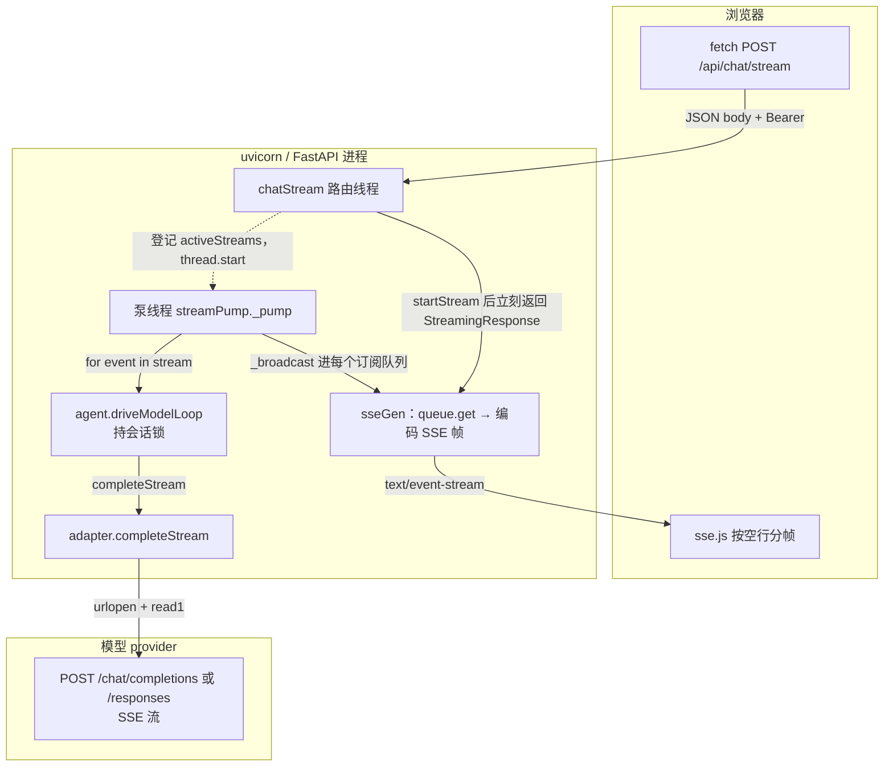
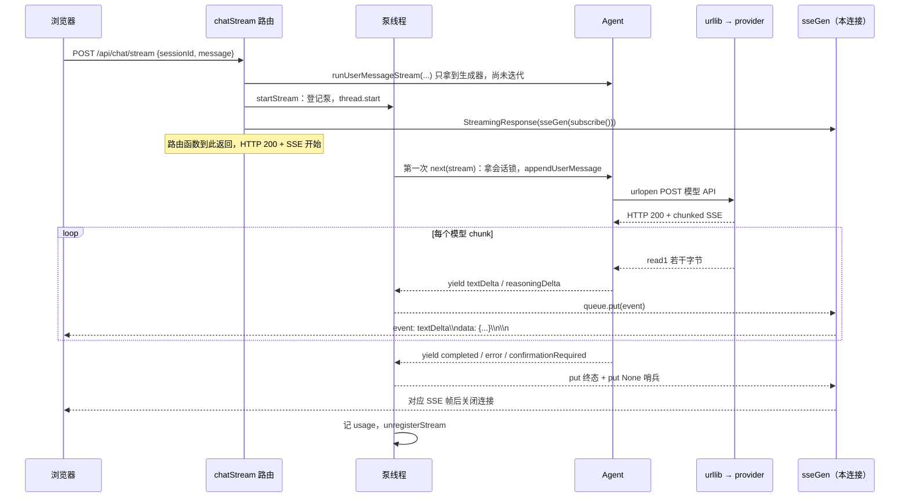
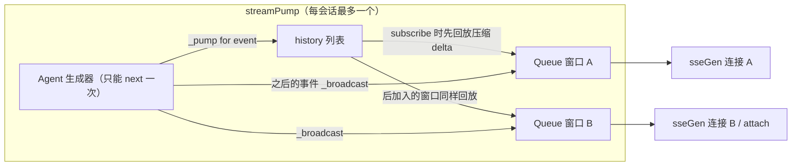
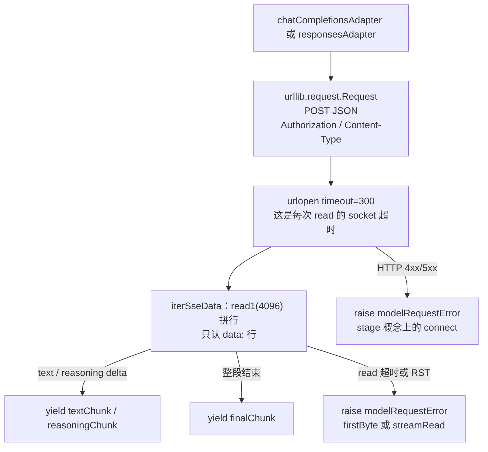

# 泵线程与 API 请求底层（streamPumpArchitecture）

- 日期：2026-09-02
- 对照代码：`webApp/backend/server.py`、`agentManager.py`、`sseCodec.py`、`flamingoAgents/core/agent.py`、`flamingoAgents/models/chatCompletions.py`

本文只解释**现状**，不改行为。

## 0. 从零一层一层讲（先读这个）

把一次「点发送」想成餐厅，不要先想线程。

| 角色 | 对应代码 | 干什么 |
|------|----------|--------|
| 你（食客） | 浏览器 | 点菜，然后坐着等一盘盘上来 |
| 前台 | `chatStream` 路由 | 开单、喊后厨，**自己不炒菜** |
| 后厨（全店只有一个灶） | **泵线程** | 真的去做这一桌：问模型、跑工具 |
| 传菜口 | 每个窗口自己的队列 | 后厨每出一道菜，往每个窗口的盘子里各放一份 |
| 供应商 | OpenAI / 各模型 API | 另一家店，后厨打电话问他们 |

下面按层。每一层只多一个概念。

### 第 0 层：你点发送之后，浏览器在干什么

浏览器**不是** `POST` 完等一个 `{answer: "..."}` 的 JSON。

它打开一条连接，一直读服务器往下吐的文本，一块一块来，例如：

```
event: textDelta
data: {"text":"你"}

event: textDelta
data: {"text":"好"}

event: completed
data: {"message":"你好"}
```

这叫 SSE：连接不关，事件按空行切开。前端 `sse.js` 自己拆这些行。

到这里你只需要记住：**浏览器和本机 Web 之间有一条「一直开着的水管」。**

### 第 1 层：这根水管的另一头不是模型

模型在别的公司的服务器上。浏览器**没有**拿着 API Key 去连 OpenAI。

所以实际上是 **两根水管**，中间隔着你的 Python 进程：

```
水管 A：  浏览器  <----SSE---->  你的 FastAPI
水管 B：  你的 Python  <----SSE---->  模型公司
```

两根管子物理上完全不相通。必须有人把 B 里读到的字，抄到 A 里发给浏览器。

### 第 2 层：前台（路由）只开单，立刻走开

`POST /api/chat/stream` 进到 `chatStream` 之后，它做的是：

1. 找到这个 session 的 Agent（没有就新建）。
2. 调用 `runUserMessageStream(消息)` —— **这时模型还没开始跑。**  
   得到的是一个「任务说明书」（Python 生成器：一个还没执行的懒函数）。
3. 叫人新建一个泵，**另开一条线程** 去执行那份说明书。
4. 把**当前这个浏览器连接**登记为「要听结果」。
5. 函数返回。HTTP 已经 200 了，水管 A 开始往浏览器灌。

前台不会站在厨房里等菜炒完。否则一个用户思考 2 分钟，这根处理请求的线程就卡死 2 分钟，别的事也难做；更麻烦的是下面第 4 层。

### 第 3 层：泵线程 = 唯一真正干活的人

泵就是一个 `threading.Thread`，线程函数差不多是：

```python
for event in agent生成器:   # 这里才会真正跑模型、跑工具
    记到 history
    复制一份到每个窗口的队列
```

- **生成器** = 说明书。谁第一次 `for` 它，谁才触发里面的代码。
- 说明书**只能被 for 一次**。第二个 `for` 拿不到同样的事件。
- 所以全店只允许一个灶：同一会话同时只能有一个泵（再点发送会 409）。

泵在干什么的时候会卡住（这是正常的）：

- 等模型下一个字（`read1` 阻塞）
- 等 bash 跑完
- 等你点「允许删除文件」

卡住的是泵线程，**不是**浏览器那根水管。水管 A 的另一头（`sseGen`）只是坐在队列前面等菜。

### 第 4 层：为什么必须「抄到队列」而不能让浏览器直接 for Agent

假如省掉泵，写成：

```python
# 反例，当前不是这样
for event in agent生成器:
    yield 编码成SSE(event)
```

会出三件事：

1. 你再开一个窗口想看同一轮输出 → 生成器已经被第一个窗口吃掉了，没了。
2. 你关掉标签 → 这个 for 循环被取消 → 模型调用、工具半路停掉，账单也可能没记完。
3. 停止按钮不好做：你只能等模型下一次 yield 才会看到「该停了」。

有了泵：

- 后厨照炒。
- 每个浏览器只是在传菜口领自己的那一叠盘子（自己的 `Queue`）。
- 关一个窗口 = 这个窗口不领菜了（`unsubscribe`），灶还在烧。
- 第二个窗口 `POST /api/chat/attach` = 再拿一个盘子，先把已经出过的菜（history）倒一遍，再接下新菜。

**「泵」就是这个意思：把只能流一次的 Agent 输出，泵进一个可以多人接的水箱。**

### 第 5 层：Agent 里面发生什么（仍在泵线程里）

泵一 `for`，才进入 `driveModelLoop`：

1. 锁住这个 session（同时不能有两轮对话交织）。
2. 把你的用户消息写入 jsonl。
3. 调 adapter：向模型公司 POST 一整段对话 + 工具定义。
4. 模型每吐一个字，Agent `yield textDelta` → 泵抄进队列 → `sseGen` 发给浏览器 → 你看见字往外蹦。
5. 若模型要调工具：跑 read/bash/…，把结果再发给模型，循环，直到模型说人话结束，或要你确认。

你看到的「流式输出」，是这条链上一次次 `yield`，不是浏览器直连模型。

### 第 6 层：模型那根水管（水管 B）长什么样

没有官方 SDK。就是标准库：

```python
urllib.request.urlopen(POST JSON, timeout=300)
# 然后循环 response.read1(4096) 读返回体
```

`timeout=300` 的意思：**连续 300 秒一个字节都没有** 才断开。中间一直有数据可以一直读，不是整轮最多 5 分钟。

模型公司返回的也是 SSE（`data: {"choices":[{"delta":{"content":"你"}}]}`）。adapter 把它翻译成 Agent 认识的 `textChunk`。

若这里断了（超时、RST、403、502），异常发生在泵线程、adapter 里。浏览器那根水管可能仍开着，直到 Agent 吐出一个 `error` 事件，泵再抄给你。

这就是「模型 response 断了」和「网页连接断了」不是同一件事。

### 第 7 层：把层次叠起来（同一时刻谁在哪）

假设模型正在一个字一个字地吐：

```
浏览器线程        等 fetch 读到下一帧
    ↑
sseGen            阻塞在 queue.get()，队列暂时是空的
    ↑  泵刚 put 了一个 textDelta
泵线程            卡在 adapter.read1()，等模型下一个字节
    ↑
操作系统 socket   水管 B，连着模型公司
```

四段人马，四段等待。中间靠队列和 yield 接力。没有一个「巨大的 async 请求」贯穿全程。

---

## 1. 一句话

**泵线程**（`streamPump`）是 Web 层专门拉「Agent 事件生成器」的后台线程：Agent 生成器只能被消费一次，而且会长时间阻塞（等模型 SSE、跑工具）。泵把它拉完，把事件放进内存 `history`，再复制到每个浏览器连接自己的 `queue.Queue`。浏览器连的不是 Agent，连的是自己的那条队列。

没有泵的话：一个 HTTP 连接直接 `for event in agent.stream`，第二个窗口无法 attach，关页会把生成器一起掐死，usage 也记不全。

## 2. 底层不是 async LLM 客户端

当前模型请求**不是** `httpx`/`aiohttp`，也不是 OpenAI 官方 SDK。

| 层 | 实际技术 |
|----|----------|
| 浏览器 → Web | `fetch` POST + 手写解析 SSE（`webApp/frontend/js/sse.js`）。`EventSource` 不能自定义 Header，所以不用。 |
| Web 路由 | FastAPI **同步** `def chatStream`（跑在 uvicorn 线程池，不是 async 协程里跑模型）。 |
| 浏览器 ← Web | `StreamingResponse` 迭代同步生成器 `sseGen`，`media_type=text/event-stream`。 |
| Agent | 同步生成器 `runUserMessageStream` → `driveModelLoop`，持会话锁。 |
| 模型 HTTP | `urllib.request.urlopen(..., timeout=300)`，响应体用 `read1(4096)` 读 SSE。 |

所以「API 请求」其实是**两段独立的 HTTP**：

1. 浏览器 ↔ 本机 FastAPI（SSE 下行）
2. 本机 urllib ↔ 模型 provider（另一条 SSE 下行）

泵夹在这两段中间，不参与套接字读写。

## 3. 总览



路由线程只做「建泵 + 把当前连接 subscribe 上去」，然后把连接交给 `sseGen`。真正跑模型和工具的是**泵线程**。

## 4. 一次发消息的时序



要点：`runUserMessageStream` 是**惰性生成器**。`appendUserMessage` 写 jsonl 发生在泵线程第一次迭代，不在路由线程。所以 `baseCount` 能在写盘之前采样（给另一窗口 attach 当水位线）。

## 5. 泵内部：一生产者，多订阅者



同会话已有泵时 `startStream` 返回 `None`，路由映射 **409**。第二个窗口要看正在打的字，走 `POST /api/chat/attach`，只 `subscribe()`，不新建泵。

浏览器关页 → `sseGen` 的 `finally` → `unsubscribe`。**泵继续跑**，模型不会因为你关了一个标签而停。这就是「断连」和「模型流断了」不是一回事的原因。

停止：`POST /api/chat/stop` → `requestStop`：`stopFlag` + `interruptActiveStreams`（shutdown 模型 socket）+ 广播 `errorType=stopped` + 关所有订阅队列。

## 6. 模型这一段 HTTP 长什么样



- Chat Completions：`{baseUrl}/chat/completions`，`stream: true`。
- Responses（Codex / xAI）：`{baseUrl}/responses` 或 `/codex/responses`。
- 300s 是**单次 read 静默上限**，不是整轮墙钟上限。中间一直有 chunk 就可以一直读。
- Agent 侧若已经 `yield` 过 text/reasoning（`chunkSeen=True`），再断流**不重试**。

## 7. 和「日志薄弱」的关系

jsonl 写在 Agent / conversation 上（泵线程调用栈里）。浏览器 SSE 只是把同一批事件再编码一遍。所以：

- 模型为什么断：要看 adapter → `modelError`（方案 v1.2 要补 stage/耗时）。
- 关页：只 `unsubscribe`，jsonl 里本来就没有「浏览器断开」。
- 泵自己崩了：现在只 `_broadcast(errorEvent)`，jsonl 没有 `pumpError`（方案 B3）。

诊断补强（`docs/plan/modelStreamDiagnosisPlan.md`）加的是 jsonl 字段，不改这张图上的线程结构。
